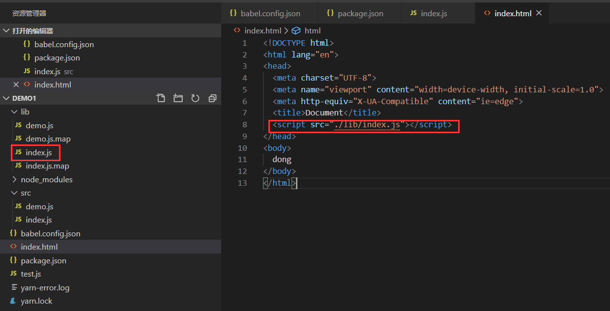
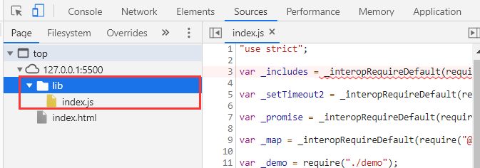
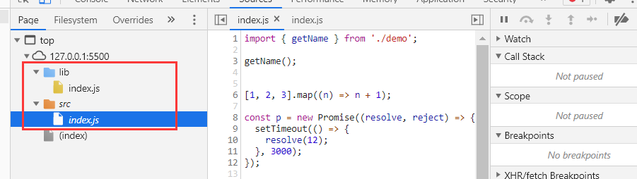
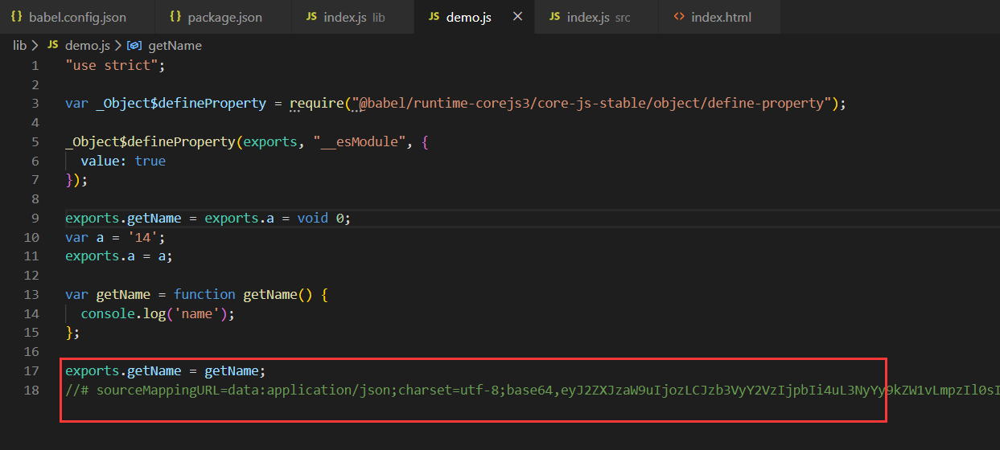

# @babel/cli

babel自带的一个内置的cli命令行工具，可以通过命令行编写文件。

此外，各种可直接调用脚本都存在`@babel/cli/bin`中，一个可通过shell执行的实用脚本`babel-external-helpers.js`，以及babel cli主脚本`babel.js`。

> 请在执行 npx babel 之前首先要安装 @babel/cli 和 @babel/core ，否则 npx 将安装老旧的 babel 6.x 版本。除了 npx 之外，你还可以将命令写入 npm 运行脚本 中，否则你就只能使用相对路径（./node_modules/.bin/babel）来使用 Babel 了。

* 如果是命令行 则需要使用`npx babel ...`

* 如果是`script`，则可以写成`babel ...`

* 可以使用相对的`./node_modules/.bin/babel`

 

#### 编译文件

1、编译 script.js 文件并 输出到标准输出设备（stdout）。

`npx babel script.js`

2、如果你希望 输出到文件 ，可以使用 --out-file 或 -o 参数。或者合并多个文件输出

`npx babel script.js --out-file script-compiled.js`

3、要在 每次文件修改后 编译该文件，请使用 --watch 或 -w 参数：

`npx babel script.js --watch --out-file script-compiled.js`

 

#### 编译并输出源码映射表

1、希望输出源码映射文件(source map),你可以使用 `--source-maps` 或 `-s` 参数

`npx babel script.js --out-file script-compiled.js --source-maps`
或package.json `babel src --out-dir lib -s`

> 例如：html引入编译后的源文件

不生成source-map文件, 此时只有编译后的index.js文件

生成source-map文件, 浏览器中增加了src/index.js编译前的源文件，便于代码调试

2、如果你希望使用 内联源码映射表（inline source maps），请使用 `--source-maps inline | -s inline` 参数

此时不生成对应的map文件，而是将映射表的信息，添加到编译后的文件中，如下，底部添加了map文件信息。

 

#### 编译整个目录

编译整个 `src` 目录下的文件并输出到 `lib` 目录，输出目录可以通过 `--out-dir` 或 `-d` 指定。`这不会覆盖 lib 目录下的任何其他文件或目录`。

`npx babel src --out-dir lib`

编译整个 src 目录下的文件并将输出合并为一个文件。

`npx babel src --out-file lib.js`

 

#### 忽略某些文件 --ignore

忽略规范和测试文件

`npx babel src --out-dir lib --ignore "src/**/*.spec.js","src/**/*.test.js"`

 

#### 使用插件和预设

`--plugins, --presets`

`npx babel script.js --out-file script-compiled.js --plugins=@babel/proposal-class-properties,@babel/transform-modules-amd`

`npx babel script.js --out-file script-compiled.js --presets=@babel/preset-env,@babel/flow`

 

#### 指定配置文件位置

`--config-file`

`npx babel --config-file /path/to/my/babel.config.json --out-dir dist ./src`