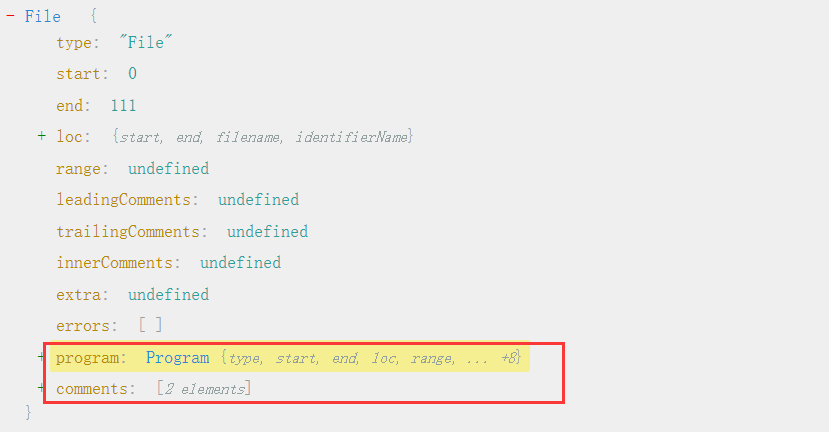
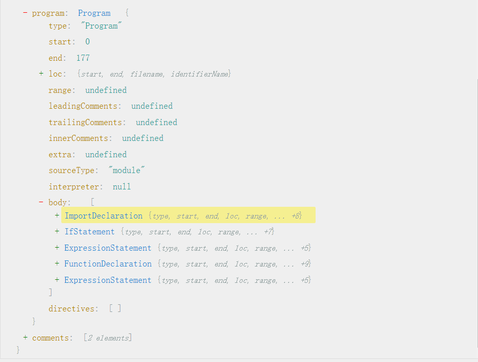

`babel`的功能非常纯粹，将源码以字符串的形式传给它，经过处理后返回一段`新的代码字符串(以及sourcemap)`, 它就是一个编译器，输入`ES6+`代码，输出`ES5`代码。

`babel`编译分三个阶段：

* `解析(Parse)`：将代码字符串解析成抽象语法树(AST树)

   一般来说每个`js引擎`都有自己的`AST`，比如熟知的`v8`，`chrome`浏览器会把 js 源码转换为抽象语法树，再进一步转换为`字节码`或`机器代码`, `babel`则是通过`babylon`实现的 。简单来说就是一个对于 JS 代码的一个编译过程，进行了`词法分析`与`语法分析`的过程。

* `变换(Transform)`: 对抽象语法树进行变换操作

    对于`AST`进行变换一系列的操作，`babel`接受得到`AST`并通过`babel-traverse`对其进行遍历，在此过程中进行添加、更新及移除等操作。

* `生成(Generate)`: 根据变换后的抽象语法树再生成代码字符串

  将变换后的`AST`再转换为 JS 代码, 使用到的模块是`babel-generator`。

而`babel-core`模块则是将三者结合使得对外提供的API做了一个简化。

注意：babel 只是转译新标准引入的语法，比如ES6箭头函数：而新标准引入的新的原生对象，部分原生对象新增的原型方法，新增的 API 等（Proxy、Set 等）, 这些事不会转译的，需要引入对应的 polyfill 来解决。

 

#### AST(abstract syntax tree)生成过程分析

[AST抽象树生成工具](https://astexplorer.net/)

~~~js
import { message as msg } from "test.js";
// alert
if (1 > 0) {
    alert('hi');
}
// message
console.log(message);
~~~

包括大的两部分：`代码部分(program)`, `注解部分(comments)`

~~~json
"comments": [
    {
      "type": "CommentLine",
      "value": " alert",
      "start": 38,
      "end": 46,
      "loc": {
        "start": {
          "line": 2,
          "column": 0
        },
        "end": {
          "line": 2,
          "column": 8
        }
      }
    },
    {
      "type": "CommentLine",
      "value": " message",
      "start": 79,
      "end": 89,
      "loc": {
        "start": {
          "line": 6,
          "column": 0
        },
        "end": {
          "line": 6,
          "column": 10
        }
      }
    }
  ]
~~~

`comments主要记录了注解的字符起始和结束位置，行号和行内的起始，结束位置`

 

`program`: 下面省略了语句的字符起始结束位置和行列起始和结束位置
~~~json
  "program": {
    "type": "Program", // 程序根节点
    "sourceType": "module", // sourceType为module
    "interpreter": null,
    "body": [
      {
        "type": "ImportDeclaration", // 标识该对象表示导入语句
        "trailingComments": [ // 尾部注解
          {
            "type": "CommentLine",
            "value": " alert"
          }
        ],
        "specifiers": [ // import { message as msg } from "test.js"; 语句拆分
          {
            "type": "ImportSpecifier", // 标识位置
            "imported": {  // 导入为message
              "type": "Identifier",
              "name": "message"
            },
            "importKind": null,
            "local": {  // 导入重命名msg
              "type": "Identifier",
              "loc": {
                "identifierName": "msg"
              },
              "name": "msg"
            }
          }
        ],
        "importKind": "value",
        "source": { // 即要导入的源文件
          "type": "StringLiteral", // 字符串字面量
          "extra": {  // 即要导入的test.js
            "rawValue": "test.js",
            "raw": "\"test.js\""
          },
          "value": "test.js"
        },
        "assertions": []
      },
      {
        "type": "IfStatement", // if 语句
        "leadingComments": [ // 该语句前面的注解
          {
            "type": "CommentLine",
            "value": " alert",
          }
        ],
        "trailingComments": [ // 该语句后面的注解
          {
            "type": "CommentLine",
            "value": " message",
          }
        ],
        "test": { // if语句的判断条件
          "type": "BinaryExpression", // 一个双元运算表达式节点 即： 1 > 0
          "left": { // 运算符左侧值
            "type": "NumericLiteral", // 数字字面量
            "extra": { // 1
              "rawValue": 1,
              "raw": "1"
            },
            "value": 1
          },
          "operator": ">", // 运算表达式的运算符
          "right": {
            "type": "NumericLiteral", // 运算符右侧值
            "extra": { // 0
              "rawValue": 0,
              "raw": "0"
            },
            "value": 0
          }
        },
        "consequent": { //  if语句条件满足时的执行内容
          "type": "BlockStatement",
          "body": [ // 代码块内的语句数组
            {
              "type": "ExpressionStatement",
              "expression": { // 一个函数调用表达式节点
                "type": "CallExpression",
                "callee": { // 被调用者 alert
                  "type": "Identifier", // 一个标识符表达式节点
                  "loc": {
                    "identifierName": "alert"
                  },
                  "name": "alert"
                },
                "arguments": [ // 调用参数
                  {
                    "type": "StringLiteral",
                    "extra": {
                      "rawValue": "hi",
                      "raw": "'hi'"
                    },
                    "value": "hi"
                  }
                ]
              }
            }
          ],
          "directives": []
        },
        "alternate": null
      },
      {
        "type": "ExpressionStatement", // 一个函数调用表达式节点 console.log(message);
        "leadingComments": [ // 前面注解
          {
            "type": "CommentLine",
            "value": " message"
          }
        ],
        "expression": { // 函数调用表达式
          "type": "CallExpression",
          "callee": { // 
            "type": "MemberExpression", // 成员表达式console.log
            "object": {
              "type": "Identifier",
              "name": "console"
            },
            "computed": false,
            "property": { // log属性
              "type": "Identifier",
              "loc": {
                "identifierName": "log"
              },
              "name": "log"
            }
          },
          "arguments": [ // 函数参数
            {
              "type": "Identifier",
              "loc": {
                "identifierName": "message"
              },
              "name": "message"
            }
          ]
        }
      }
    ],
    "directives": []
  }
~~~

 

~~~js
import { message as msg }  from "test.js";
// alert
if (1 > 0) {
    alert('hi');
}
// message
console.log(message);

function getName(name) {
  return name;
}

getName("dong");
~~~

可以看到程序代码被拆分成一个个的代码块，比如上面代码包括：`ImportDeclaration`、`IfStatement`、`ExpressionStatement`、`FunctionDeclaration`、`ExpressionStatement`

 
 

第1步转换的过程中可以验证语法的正确性，同时由字符串变为对象结构后更有利于精准地分析以及进行代码结构调整。

第2步原理就很简单了，就是遍历这个对象所描述的抽象语法树，遇到哪里需要做一下改变，就直接在对象上进行操作，比如我把IfStatement给改成WhileStatement就达到了把条件判断改成循环的效果。

第3步也简单，递归遍历这颗语法树，然后生成相应的代码，大概的实现逻辑如下：

`根据上面的实例，代码会被拆分成一个个代码块，因此AST树变换后，根据每个代码块重新生成代码即可`。

~~~js
function types(node) {
  Program (node) {
    return node.body.map(child => generate(child));
  },
  IfStatement (node) {
    let code = `if (${generate(node.test)}) ${generate(node.consequent)}`;
    if (node.alternative) {
      code += `else ${generate(node.alternative)}`;
    }
    return code;
  },
  BlockStatement (node) {
    let code = node.body.map(child => generate(child));
    code = `{ ${code} }`;
    return code;
  },
  ...
}

function generate(node) {
  return types[node.type](node);
}

// 1、生成ast抽象树
const ast = Babel.parse(code);
// 2、对ast进行变换操作
// 3、对新的ast树重新生成代码
const generatedCode = generate(ast);
~~~

 

#### 抽象语法树如何产生

[在线分词工具](https://esprima.org/demo/parse.html#)

分为两个步骤：

* `分词`: 将整个代码字符串分割成`语法单元(token)`数组。

* `语义分析`: 在分词结果的基础上，分析`语法单元之间的关系`。

`分词`：

`语法单元`：语法单元是被解析语法当中具备实际意义的`最小单元`，通俗点说就是类似于自然语言中的词语。

JS代码有哪些语法单元呢？大致有以下这些（其他语言也许类似但通常都有区别）：

* `空白`: JS中连续的空格、换行、缩进等这些如果不在字符串里，就没有任何实际逻辑意义，所以把连续的空白符直接组合在一起作为一个语法单元。

* `注释`: 行注释或块注释，虽然对于人类来说有意义，但是对于计算机来说知道这是个“注释”就行了，并不关心内容，所以直接作为一个不可再拆的语法单元

* `字符串`: 对于机器而言，字符串的内容只是会参与计算或展示，里面再细分的内容也是没必要分析的

* `数字`: JS语言里就有16、10、8进制以及科学表达法等数字表达语法，数字也是个具备含义的最小单元

* `标识符`: 没有被引号扩起来的连续字符，可包含字母、_、$、及数字（数字不能作为开头）。标识符可能代表一个变量，或者true、false这种内置常量、也可能是if、return、function这种关键字，是哪种语义，分词阶段并不在乎，只要正确切分就好了。

* `运算符`: +、-、*、/、>、<等等

* `括号`: (...)可能表示运算优先级、也可能表示函数调用，分词阶段并不关注是哪种语义，只把“(”或“)”当做一种基本语法单元

* 还有其他：如中括号、大括号、分号、冒号、点等等不再一一列举

~~~js
function tokenizeCode (code) {
  const tokens = [];    // 结果数组
  for (let i = 0; i < code.length; i++) {
    // 从0开始，一个字符一个字符地读取
    let currentChar = code.charAt(i);

    if (currentChar === ';') {
      // 对于这种只有一个字符的语法单元，直接加到结果当中
      tokens.push({
        type: 'sep',
        value: ';',
      });
      // 该字符已经得到解析，不需要做后续判断，直接开始下一个
      continue;
    }
    
    if (currentChar === '(' || currentChar === ')') {
      // 与 ; 类似只是语法单元类型不同
      tokens.push({
        type: 'parens',
        value: currentChar,
      });
      continue;
    }

    if (currentChar === '}' || currentChar === '{') {
      // 与 ; 类似只是语法单元类型不同
      tokens.push({
        type: 'brace',
        value: currentChar,
      });
      continue;
    }

    if (currentChar === '>' || currentChar === '<') {
      // 与 ; 类似只是语法单元类型不同
      tokens.push({
        type: 'operator',
        value: currentChar,
      });
      continue;
    }

    if (currentChar === '"' || currentChar === '\'') {
      // 引号表示一个字符传的开始
      const token = {
        type: 'string',
        value: currentChar,       // 记录这个语法单元目前的内容
      };
      tokens.push(token);

      const closer = currentChar;
      let escaped = false;        // 表示下一个字符是不是被转译的

      // 进行嵌套循环遍历，寻找字符串结尾
      for (i++; i < code.length; i++) {
        currentChar = code.charAt(i);
        // 先将当前遍历到的字符无条件加到字符串的内容当中
        token.value += currentChar;
        if (escaped) {
          // 如果当前转译状态是true，就将改为false，然后就不特殊处理这个字符
          escaped = false;
        } else if (currentChar === '\\') {
          // 如果当前字符是 \ ，将转译状态设为true，下一个字符不会被特殊处理
          escaped = true;
        } else if (currentChar === closer) {
          break;
        }
      }
      continue;
    }
    
    if (/[0-9]/.test(currentChar)) {
      // 数字是以0到9的字符开始的
      const token = {
        type: 'number',
        value: currentChar,
      };
      tokens.push(token);

      for (i++; i < code.length; i++) {
        currentChar = code.charAt(i);
        if (/[0-9\.]/.test(currentChar)) {
          // 如果遍历到的字符还是数字的一部分（0到9或小数点）
          // 这里暂不考虑会出现多个小数点以及其他进制的情况
          token.value += currentChar;
        } else {
          // 遇到不是数字的字符就退出，需要把 i 往回调，
          // 因为当前的字符并不属于数字的一部分，需要做后续解析
          i--;
          break;
        }
      }
      continue;
    }

    if (/[a-zA-Z\$\_]/.test(currentChar)) {
      // 标识符是以字母、$、_开始的
      const token = {
        type: 'identifier',
        value: currentChar,
      };
      tokens.push(token);

      // 与数字同理
      for (i++; i < code.length; i++) {
        currentChar = code.charAt(i);
        if (/[a-zA-Z0-9\$\_]/.test(currentChar)) {
          token.value += currentChar;
        } else {
          i--;
          break;
        }
      }
      continue;
    }
    
    if (/\s/.test(currentChar)) {
      // 连续的空白字符组合到一起
      const token = {
        type: 'whitespace',
        value: currentChar,
      };
      tokens.push(token);

      // 与数字同理
      for (i++; i < code.length; i++) {
        currentChar = code.charAt(i);
        if (/\s]/.test(currentChar)) {
          token.value += currentChar;
        } else {
          i--;
          break;
        }
      }
      continue;
    }

    // 还可以有更多的判断来解析其他类型的语法单元

    // 遇到其他情况就抛出异常表示无法理解遇到的字符
    throw new Error('Unexpected ' + currentChar);
  }
  return tokens;
}

const tokens = tokenizeCode(`
if (1 > 0) {
  alert("if 1 > 0");
}
`);
~~~

执行结果：

~~~js
[
  { type: 'whitespace', value: '\n' },
  { type: 'identifier', value: 'if' },
  { type: 'whitespace', value: ' ' },
  { type: 'parens', value: '(' },
  { type: 'number', value: '1' },
  { type: 'whitespace', value: ' ' },
  { type: 'operator', value: '>' },
  { type: 'whitespace', value: ' ' },
  { type: 'number', value: '0' },
  { type: 'parens', value: ')' },
  { type: 'whitespace', value: ' ' },
  { type: 'brace', value: '{' },
  { type: 'whitespace', value: '\n' },
  { type: 'whitespace', value: ' ' },
  { type: 'whitespace', value: ' ' },
  { type: 'identifier', value: 'alert' },
  { type: 'parens', value: '(' },
  { type: 'string', value: '"if 1 > 0"' },
  { type: 'parens', value: ')' },
  { type: 'sep', value: ';' },
  { type: 'whitespace', value: '\n' },
  { type: 'brace', value: '}' },
  { type: 'whitespace', value: '\n' }
]
~~~

 

~~~js
function demo (a) {
    console.log(a || 'a');
}
~~~

通过[在线分词工具](https://esprima.org/demo/parse.html#)分词结果；

~~~js
[
    {
        "type": "Keyword",
        "value": "function"
    },
    {
        "type": "Identifier",
        "value": "demo"
    },
    {
        "type": "Punctuator",
        "value": "("
    },
    {
        "type": "Identifier",
        "value": "a"
    },
    {
        "type": "Punctuator",
        "value": ")"
    },
    {
        "type": "Punctuator",
        "value": "{"
    },
    {
        "type": "Identifier",
        "value": "console"
    },
    {
        "type": "Punctuator",
        "value": "."
    },
    {
        "type": "Identifier",
        "value": "log"
    },
    {
        "type": "Punctuator",
        "value": "("
    },
    {
        "type": "Identifier",
        "value": "a"
    },
    {
        "type": "Punctuator",
        "value": "||"
    },
    {
        "type": "String",
        "value": "'a'"
    },
    {
        "type": "Punctuator",
        "value": ")"
    },
    {
        "type": "Punctuator",
        "value": ";"
    },
    {
        "type": "Punctuator",
        "value": "}"
    }
]
~~~

AST抽象语法树：
~~~json
{
  "type": "Program",
  "body": [
    {
      "type": "FunctionDeclaration",
      "id": {
        "type": "Identifier",
        "name": "demo"
      },
      "params": [
        {
          "type": "Identifier",
          "name": "a"
        }
      ],
      "body": {
        "type": "BlockStatement",
        "body": [
          {
            "type": "ExpressionStatement",
            "expression": {
              "type": "CallExpression",
              "callee": {
                "type": "MemberExpression",
                "computed": false,
                "object": {
                  "type": "Identifier",
                  "name": "console"
                },
                "property": {
                  "type": "Identifier",
                  "name": "log"
                }
              },
              "arguments": [
                {
                  "type": "LogicalExpression",
                  "operator": "||",
                  "left": {
                    "type": "Identifier",
                    "name": "a"
                  },
                  "right": {
                    "type": "Literal",
                    "value": "a",
                    "raw": "'a'"
                  }
                }
              ]
            }
          }
        ]
      },
      "generator": false,
      "expression": false,
      "async": false
    }
  ],
  "sourceType": "script"
}
~~~

 

`语义分析`:

语义分析的过程又是个遍历语法单元的过程，不过相比较而言更复杂，因为分词过程中，每个语法单元都是独立平铺的，而语法分析中，语句和表达式会以树状的结构互相包含。针对这种情况我们可以用栈，也可以用递归来实现。

我继续上面的例子给出语义分析的代码，代码很长，先在最开头说明几个函数是做什么的：

* `nextStatement`: 读取并返回下一个语句

* `nextExpression`: 读取并返回下一个表达式

* `nextToken`: 读取下一个语法单元（或称符号），赋值给curToken

* `stash`: 暂存当前读取符号的位置，方便在需要的时候返回

* `rewind`: 返回到上一个暂存点

* `commit`: 上一个暂存点不再被需要，将其销毁

这里stash、rewind、commit都跟读取位置暂存相关，什么样的情况会需要返回到暂存点呢？有时同一种语法单元有可能代表不同类型的表达式的开始。先stash，然后按照其中一种尝试解析，如果解析成功了，那么暂存点就没用了，commit将其销毁。如果解析失败了，就用rewind回到原来的位置再按照另一种方式尝试去解析。

~~~js
function parse (tokens) {
  let i = -1;     // 用于标识当前遍历位置
  let curToken;   // 用于记录当前符号

  // 读取下一个语句
  function nextStatement () {
    // 暂存当前的i，如果无法找到符合条件的情况会需要回到这里
    stash();
    
    // 读取下一个符号
    nextToken();

    if (curToken.type === 'identifier' && curToken.value === 'if') {
      // 解析 if 语句
      const statement = {
        type: 'IfStatement',
      };
      // if 后面必须紧跟着 (
      nextToken();
      if (curToken.type !== 'parens' || curToken.value !== '(') {
        throw new Error('Expected ( after if');
      }

      // 后续的一个表达式是 if 的判断条件
      statement.test = nextExpression();

      // 判断条件之后必须是 )
      nextToken();
      if (curToken.type !== 'parens' || curToken.value !== ')') {
        throw new Error('Expected ) after if test expression');
      }

      // 下一个语句是 if 成立时执行的语句
      statement.consequent = nextStatement();

      // 如果下一个符号是 else 就说明还存在 if 不成立时的逻辑
      if (curToken === 'identifier' && curToken.value === 'else') {
        statement.alternative = nextStatement();
      } else {
        statement.alternative = null;
      }
      commit();
      return statement;
    }

    if (curToken.type === 'brace' && curToken.value === '{') {
      // 以 { 开头表示是个代码块，我们暂不考虑JSON语法的存在
      const statement = {
        type: 'BlockStatement',
        body: [],
      };
      while (i < tokens.length) {
        // 检查下一个符号是不是 }
        stash();
        nextToken();
        if (curToken.type === 'brace' && curToken.value === '}') {
          // } 表示代码块的结尾
          commit();
          break;
        }
        // 还原到原来的位置，并将解析的下一个语句加到body
        rewind();
        statement.body.push(nextStatement());
      }
      // 代码块语句解析完毕，返回结果
      commit();
      return statement;
    }
    
    // 没有找到特别的语句标志，回到语句开头
    rewind();

    // 尝试解析单表达式语句
    const statement = {
      type: 'ExpressionStatement',
      expression: nextExpression(),
    };
    if (statement.expression) {
      nextToken();
      if (curToken.type !== 'EOF' && curToken.type !== 'sep') {
        throw new Error('Missing ; at end of expression');
      }
      return statement;
    }
  }

  // 读取下一个表达式
  function nextExpression () {
    nextToken();

    if (curToken.type === 'identifier') {
      const identifier = {
        type: 'Identifier',
        name: curToken.value,
      };
      stash();
      nextToken();
      if (curToken.type === 'parens' && curToken.value === '(') {
        // 如果一个标识符后面紧跟着 ( ，说明是个函数调用表达式
        const expr = {
          type: 'CallExpression',
          caller: identifier,
          arguments: [],
        };

        stash();
        nextToken();
        if (curToken.type === 'parens' && curToken.value === ')') {
          // 如果下一个符合直接就是 ) ，说明没有参数
          commit();
        } else {
          // 读取函数调用参数
          rewind();
          while (i < tokens.length) {
            // 将下一个表达式加到arguments当中
            expr.arguments.push(nextExpression());
            nextToken();
            // 遇到 ) 结束
            if (curToken.type === 'parens' && curToken.value === ')') {
              break;
            }
            // 参数间必须以 , 相间隔
            if (curToken.type !== 'comma' && curToken.value !== ',') {
              throw new Error('Expected , between arguments');
            }
          }
        }
        commit();
        return expr;
      }
      rewind();
      return identifier;
    }

    if (curToken.type === 'number' || curToken.type === 'string') {
      // 数字或字符串，说明此处是个常量表达式
      const literal = {
        type: 'Literal',
        value: eval(curToken.value),
      };
      // 但如果下一个符号是运算符，那么这就是个双元运算表达式
      // 此处暂不考虑多个运算衔接，或者有变量存在
      stash();
      nextToken();
      if (curToken.type === 'operator') {
        commit();
        return {
          type: 'BinaryExpression',
          left: literal,
          right: nextExpression(),
        };
      }
      rewind();
      return literal;
    }

    if (curToken.type !== 'EOF') {
      throw new Error('Unexpected token ' + curToken.value);
    }
  }

  // 往后移动读取指针，自动跳过空白
  function nextToken () {
    do {
      i++;
      curToken = tokens[i] || { type: 'EOF' };
    } while (curToken.type === 'whitespace');
  }

  // 位置暂存栈，用于支持很多时候需要返回到某个之前的位置
  const stashStack = [];

  function stash (cb) {
    // 暂存当前位置
    stashStack.push(i);
  }

  function rewind () {
    // 解析失败，回到上一个暂存的位置
    i = stashStack.pop();
    curToken = tokens[i];
  }

  function commit () {
    // 解析成功，不需要再返回
    stashStack.pop();
  }
  
  const ast = {
    type: 'Program',
    body: [],
  };

  // 逐条解析顶层语句
  while (i < tokens.length) {
    const statement = nextStatement();
    if (!statement) {
      break;
    }
    ast.body.push(statement);
  }
  return ast;
}

const ast = parse([
 { type: "whitespace", value: "\n" },
 { type: "identifier", value: "if" },
 { type: "whitespace", value: " " },
 { type: "parens", value: "(" },
 { type: "number", value: "1" },
 { type: "whitespace", value: " " },
 { type: "operator", value: ">" },
 { type: "whitespace", value: " " },
 { type: "number", value: "0" },
 { type: "parens", value: ")" },
 { type: "whitespace", value: " " },
 { type: "brace", value: "{" },
 { type: "whitespace", value: "\n " },
 { type: "identifier", value: "alert" },
 { type: "parens", value: "(" },
 { type: "string", value: "\"if 1 > 0\"" },
 { type: "parens", value: ")" },
 { type: "sep", value: ";" },
 { type: "whitespace", value: "\n" },
 { type: "brace", value: "}" },
 { type: "whitespace", value: "\n" },
]);
~~~

执行结果：

~~~js
{
  "type": "Program",
  "body": [
    {
      "type": "IfStatement",
      "test": {
        "type": "BinaryExpression",
        "left": {
          "type": "Literal",
          "value": 1
        },
        "right": {
          "type": "Literal",
          "value": 0
        }
      },
      "consequent": {
        "type": "BlockStatement",
        "body": [
          {
            "type": "ExpressionStatement",
            "expression": {
              "type": "CallExpression",
              "caller": {
                "type": "Identifier",
                "value": "alert"
              },
              "arguments": [
                {
                  "type": "Literal",
                  "value": "if 1 > 0"
                }
              ]
            }
          }
        ]
      },
      "alternative": null
    }
  ]
}
~~~

 
 
 
 

[参考](https://zhuanlan.zhihu.com/p/27289600)