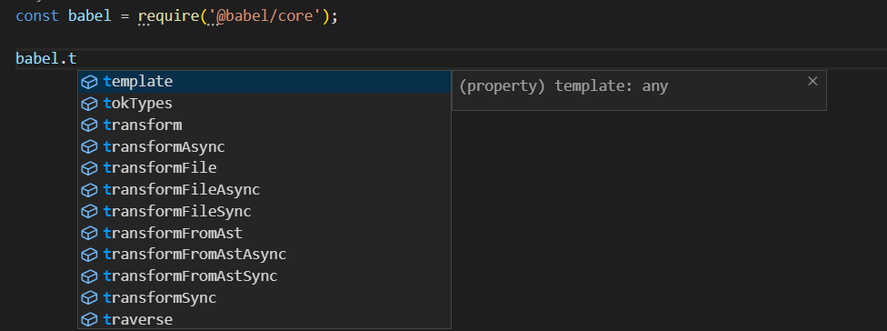

#### 概览

展示如何将ES2015+语法的javascript代码编译为能在当前浏览器上正常工作的代码，这将涉及到`新语法的转换`和`缺失特性`的修补。

整个配置过程：

1、安装babel所需要的包：

~~~
yarn add @babel/core @babel/cli @babel/preset-env --dev
~~~

* `@babel/core`: babel转换的核心包

* `@babel/cli`: 提供babel命令行工具

* `@babel/preset-env`: babel转换的最基本的预设

`@babel/preset-env是多个plugin的集合，用于告诉babel如何转换ES6+的语法，这样就不用一个一个的plugin去添加了，因为babel只是负责code => code 因此假如没有babel.config.json则代码是不会被转换的.`

2、项目根目录下新建`babel.config.json`配置文件(需要`v7.8.0`或更高版本), 旧版本使用`babel.config.js`

~~~json
{
  "presets": [
    ["@babel/preset-env", {}]
  ],
  "plugins": [
  ]
}
~~~

3、运行babel，将`src`目录下的所有代码编译到`lib`目录。

~~~
./node_modules/.bin/babel src --out-dir lib
或
npx babel src --out-dir lib
~~~

注：现在的配置只转换`ES6+`中新的语法，不能转换新的api，比如`Primise`等。

~~~js
// demo.js
export const a = '14';

export const getName = () => {
  console.log('name');
}
~~~

转换后：箭头函数被转换成普通函数。

~~~js
// demo.js
"use strict";

Object.defineProperty(exports, "__esModule", {
  value: true
});
exports.getName = exports.a = void 0;
var a = '14';
exports.a = a;

var getName = function getName() {
  console.log('name');
};

exports.getName = getName;
~~~

 

#### CLI命令行的基本用法

从版本`7`开始，babel相关的包都以`@babel`作为冠名。`@babel/core`, `@babel/cli`。

核心库：

babel的核心功能包含在`@babel/core`模块中，可以在js程序中直接`require`并使用它。

提供了很多方法，可以直接使用。

~~~
const babel = require("@babel/core");

babel.transformSync("code", optionsObject);
~~~

  

CLI命令行工具:

`@babel/cli`是一个能够在终端使用的工具

~~~
npm install --save-dev @babel/core @babel/cli

./node_modules/.bin/babel src --out-dir lib
~~~

命令行最重要的两个参数`--presets`和 `--plugins`

 

#### 插件和预设

代码转换功能以插件的形式出现，插件是小型的js程序，`用于指导babel如何对代码进行转换`。你甚至可以编写自己的插件将你所需的任何代码转换功能应用到你的代码上，例如将`ES2015+`语法转换成`ES5`语法，我们可以使用诸如`@babel/plugin-transform-arrow-functions`之类的官方插件将箭头函数转换成普通函数。

~~~json
{
  "plugins": [
    ["@babel/plugin-transform-arrow-functions", {}]
  ]
}
~~~

~~~
yarn add @babel/plugin-tranform-arrow-functions

./node_modules/.bin/babel src --out-dir lib --plugins=@babel/plugin-transfrom-arrow-functions
~~~

~~~js
// 转换前
const getName = () => {
  console.log('name');
}
const p = new Promise((resolve, reject) => {
  setTimeout(() => {
    resolve(12);
  }, 3000);
});

// 转换后
const getName = () => {
  console.log('name');
}
const p = new Promise(function (resolve, reject) {
  setTimeout(function () {
    resolve(12);
  }, 3000);
});
~~~

对于其他新的特性或语法，我们如果也希望转换，不需要一个一个插件的去添加，可以使用一个`preset(即一组预先设定的插件)`预设。

就像插件一样，你可以根据自己所需的插件组合创建一个自己的`preset`，最基本的`preset`就是名称为`env`的`preset` `@babel/preset-env`。

~~~
npm install --save-dev @babel/preset-env

./node_modules/.bin/babel src --out-dir lib --presets=@babel/env
~~~

如果不进行任何配置，上述preset所包含的插件将支持所有新的javascript(ES6+)特性，但是`preset`也支持参数。

 

#### 配置

~~~json
{
  "presets": [
    [
      "@babel/env",
      {
        "targets": {
          "edge": "17",
          "firefox": "60",
          "chrome": "67",
          "safari": "11.1"
        }
      }
    ]
  ]
}
~~~

`@babel/preset-env`只会为目标浏览器中没有的功能加载转换插件。

 

#### Polyfill

从`babel 7.4.0`开始，这个软件包就不建议使用，建议直接包含`core-js/stable`和`regenerator-runtime/runtime`。

`@babel/polyfill`模块包含`core-js`和一个自定义的`regenerator runtime`来模拟完整的ES2015+环境。

这意味着你可以使用诸如`Prmoise`和`WeakMap`之类的新的内置api、`Array.from`或`Object.assign`之类的静态语法、`Array.prototype.includes`之类的实例方法以及`生成器函数(generator functions)`(前提是你使用了regenerator插件), 为了添加这些功能，polyfill将添加`全局范围`和`类似String`这样的原生原型中。

对于软件库/工具的作者来说，这可能太多了。如果你不需要类似` Array.prototype.includes` 的实例方法，可以使用 `transform runtime` 插件而不是对全局范围（global scope）造成污染的 `@babel/polyfill`。

更进一步，如哦你确切地指导你所需要的 polyfills 功能，你可以直接从 ` core-js` 获取它们。

幸运的是，我们所使用的 `env preset` 提供了一个 `"useBuiltIns"` 参数，当此参数设置为 `"usage"` 时，就会加载上面所提到的最后一个优化措施，也就是只包含你所需要的 `polyfill`。使用此新参数后，修改配置如下:

`@babel/preset-env相对于@babel/polyfill优化的就是按需加载目标环境缺失的特性，仍然会添加全局API，因此建议使用@babel/runtime。`
~~~json
{
  "presets": [
    ["@babel/preset-env", {
      "targets": {},
      "useBuiltIns": "usage",
      "corejs": "3.6.5"
    }]
  ]
}
~~~

转换前代码：
~~~js
import { getName } from './demo';

getName();

[1, 2, 3].map((n) => n + 1);

const p = new Promise((resolve, reject) => {
  setTimeout(() => {
    resolve(12);
  }, 3000);
});

class A {
  constructor(name) {
    this.name = name;
  }
}

const [m, n, ...rest] = [1, 2, 5, 6];

console.log(rest.includes(6));
~~~

转换后代码：引入`core-js`包中的代码。

* 添加全局对象如：Set, Map, Promise 

* 给对象原型增加方法: Array.from, Array.prototype.includes

~~~js
"use strict";

require("core-js/modules/es7.array.includes.js");

require("core-js/modules/es6.string.includes.js");

require("core-js/modules/es6.function.name.js");

require("core-js/modules/es6.promise.js");

require("core-js/modules/es6.object.to-string.js");

require("core-js/modules/es6.array.map.js");

var _demo = require("./demo");

function _classCallCheck(instance, Constructor) { if (!(instance instanceof Constructor)) { throw new TypeError("Cannot call a class as a function"); } }

(0, _demo.getName)();
[1, 2, 3].map(function (n) {
  return n + 1;
});
var p = new Promise(function (resolve, reject) {
  setTimeout(function () {
    resolve(12);
  }, 3000);
});

var A = function A(name) {
  _classCallCheck(this, A);

  this.name = name;
};

var m = 1,
    n = 2,
    rest = [5, 6];
console.log(rest.includes(6));
~~~

Babel将检查所有的代码，以便查找目标环境中缺失的功能，然后只把必须的`polyfill`包含进来。

 

#### 转换API

`@babel/runtime` 仅仅包括`helpers`, 如果需要`core-js`可以使用`@babel/runtime-corejs3`,对于两者仍然需要`@babel/plugin-transfrom-runtime`

~~~js
// install the runtime as a dependency
npm install @babel/runtime

// install the plugin as a devDependency
npm install @babel/plugin-transform-runtime --save-dev
~~~

~~~json
{
  "plugins": ["@babel/plugin-transform-runtime"]
}
~~~

如果需要`transform-runtime`支持的`core-js`, 可以添加`corejs`同时添加依赖`@babel/runtime-corejs3`去替代`@babel/runtime`。

~~~js
//  install the runtime as a dependency
npm install @babel/runtime-corejs2

// install the plugin as a devDependency
npm install @babel/plugin-transform-runtime --save-dev
~~~

1、使用`@babel/preset-env`的`core-js`转换新API

`@babel/preset-env相对于@babel/polyfill优化的就是按需加载目标环境缺失的特性，仍然会添加全局API，因此建议使用@babel/runtime。`

~~~json
{
  "presets": [
    ["@babel/preset-env", {
      "targets": {},
      "useBuiltIns": "usage",
      "corejs": "3.6.5"
    }]
  ]
}
~~~
转换后的代码：添加全局变量和对象的原型方法等处理。
~~~js
"use strict";

require("core-js/modules/es.array.includes.js");

require("core-js/modules/es.array.map.js");

require("core-js/modules/es.function.name.js");

require("core-js/modules/es.object.to-string.js");

require("core-js/modules/es.promise.js");

require("core-js/modules/es.string.includes.js");

require("core-js/modules/web.timers.js");

var _demo = require("./demo");

function _classCallCheck(instance, Constructor) { if (!(instance instanceof Constructor)) { throw new TypeError("Cannot call a class as a function"); } }

(0, _demo.getName)();
[1, 2, 3].map(function (n) {
  return n + 1;
});
var p = new Promise(function (resolve, reject) {
  setTimeout(function () {
    resolve(12);
  }, 3000);
});

var A = function A(name) {
  _classCallCheck(this, A);

  this.name = name;
};

var m = 1,
    n = 2,
    rest = [5, 6];
console.log(rest.includes(6));
~~~

2、使用`@babel/plugin-transfrom-runtime`和`@babel/runtime-corejs3`处理新API

~~~json
{
  "presets": [
    ["@babel/preset-env", {}]
  ],
  "plugins": [
    ["@babel/plugin-transform-runtime", {
      "corejs": 3
    }]
  ]
}
~~~

转换后的代码：运行时引入`@babel/runtime-corejs3`包的代码。
~~~js
"use strict";

var _interopRequireDefault = require("@babel/runtime-corejs3/helpers/interopRequireDefault");

var _includes = _interopRequireDefault(require("@babel/runtime-corejs3/core-js-stable/instance/includes"));

var _classCallCheck2 = _interopRequireDefault(require("@babel/runtime-corejs3/helpers/classCallCheck"));

var _setTimeout2 = _interopRequireDefault(require("@babel/runtime-corejs3/core-js-stable/set-timeout"));

var _promise = _interopRequireDefault(require("@babel/runtime-corejs3/core-js-stable/promise"));

var _map = _interopRequireDefault(require("@babel/runtime-corejs3/core-js-stable/instance/map"));

var _demo = require("./demo");

var _context;

(0, _demo.getName)();
(0, _map["default"])(_context = [1, 2, 3]).call(_context, function (n) {
  return n + 1;
});
var p = new _promise["default"](function (resolve, reject) {
  (0, _setTimeout2["default"])(function () {
    resolve(12);
  }, 3000);
});

var A = function A(name) {
  (0, _classCallCheck2["default"])(this, A);
  this.name = name;
};

var m = 1,
    n = 2,
    rest = [5, 6];
console.log((0, _includes["default"])(rest).call(rest, 6));
~~~

  

#### 常用插件

| 包名      | 功能 | 说明 |
|  :---       |    :---     |  :---   |
| @babel/cli      | 命令行执行babel命令工具       |  package.json的script中使用了babel命令则需要安装   |
| @babel/preset-*   |  预设        |  一组插件的集合   |
| @babel/plugin-*    |  babel编译功能实现插件         |  告诉babel如何转换代码   |
| @babel/polyfill   |  低版本浏览器兼容库        |  已经不推荐使用，推荐通过`preset-env`的useBuiltIns属性按需引入   |
| core-js@*   |  低版本浏览器兼容看        |  通过`preset-env`和`polyfill`需要安装并通过`corejs`选项执行corejs版本   |
| @babel/plugin-transform-runtime   |  复用工具函数        |  和@babel/runtime同时存在   |
| @babel/runtime-corejs3   |  不污染变量的低版本浏览器兼容库       |  `@babel/plugin-transfrom-runtime`开启后，通过`corejs`选项指定版本，相比`polyfill`和`@babel/preset-env`更好   |
| babel-loader   |  webpack中使用babel加载文件       |  webpack中通过`babel-loader`转换js代码   |
