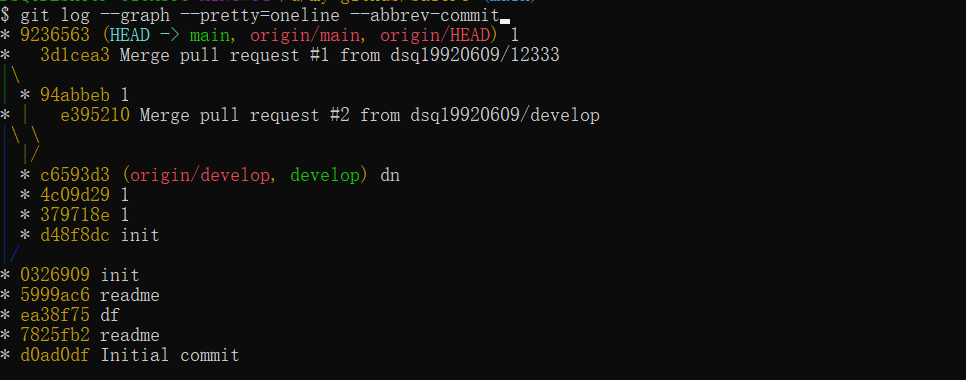

# 分支

#### 常用分支命令
~~~
查看分支：git branch

查看所有分支：git branch -a

创建分支：git branch <name>

切换分支: git checkout <name>

创建 + 切换： git checkout -b <name>

合并某分支到当前分支：git merge <branch-name> 

删除本地分支：git branch -d <branch-name>

强制删除本地分支：git branch -D <branch-name>

删除远程仓库分支：git push origin --delete <branch-name>
~~~

#### 分支策略
在实际开发中按照下面几个基本原则进行分支管理：

1、master分支是项目的主分支，是稳定的代码，用来发布项目新版本，不能在master分支上工作

2、在dev分支上开发，也就是说dev分支是不稳定的，到发布版本时，需要将dev分支的代码合并到master，然后使用master分支发布版本

3、你和你的小伙伴在dev分支上干活，每个人都有自己的分支(可以根据事务单号创建分支), 时不时往dev分支合并就可以了

4、如果有中间版本，比如测试版，预发布版本，按照优先级和流程，从dev递归合并到master

5、合并分支时，加上`--no-ff`参数就可以用普通模式合并，合并后的历史有分支，能看出来曾经做过合并，而fast forward合并就看不出来曾经做过合并。

#### 查看分支合并图
**当git无法自动合并分支时，就必须首先解决冲突**。解决冲突后，才可以继续操作
~~~
$ git log --graph
~~~

查看分支树(简洁)
~~~
git log --graph --pretty=oneline --abbrev-commit
~~~

#### git stash的应用场景  
比如正在`dev`分支上开发任务，任务完成一半时，突然有个bug要解决，则此时，可以将`dev`分支上的任务保存`git stash`, 然后创建新的分支 `temp`, 在temp分支上处理问题，处理完后将`temp`分支合并到`master`分支，然后再切回`dev`分支，`git stash pop`继续完成之前的工作。

> #### 举例
~~~
1、创建分支 develop (开发任务)

2、此时需要紧急修改bug，git stash保存当前任务

2、处理bug，创建分支temp   git checkout -b temp

3、处理完成bug后，切换到master分支1：合并分支 git merge temp  2: 发布到远程 git push origin master

4、删除temp分支：git branch -d temp

5、切换到develop分支，恢复工作，git stash pop

6、任务完成，切换到master分支，1、合并分支 git merge develop 2：发布到远程 git push origin master

7、删除develop分支： git branch -d develop

* 以上的develop,temp分支均为本地分支，不需要push到远程，开发完成并合并到master分支后，可删除
~~~

#### 保存工作现场
~~~
$ git stash
~~~

#### 查看工作列表
~~~
$ git stash list
~~~

#### 恢复后自动删除工作现场
~~~
$ git stash pop
~~~

#### 恢复工作现场  
但是恢复后，stash内容并不删除，需要手动删除   
~~~
$ git stash apply
~~~

#### 删除工作现场  
如果不指定stash_id 则删除最新的一个
~~~
$ git stash drop [stash_id]
~~~

#### 删除所有保存的工作现场
~~~
$ git stash clear
~~~

#### 恢复指定的工作现场版本
~~~
$ git stash apply <stash version>

git stash apply stash@{0}
~~~

#### 删除本地和远程分支
~~~
删除本地分支：git branch -d <branch-name>

强制删除本地分支(当删除未合并的分支时)：git branch -D <branch-name>

删除远程仓库分支：git push origin --delete <branch-name>
 
删除远程仓库分支：git push origin :<remote_branch_name> 推送一个空的分支给远程分支，相当于删除
~~~

#### 本地创建分支并推送到远程
~~~
创建本地分支：git branch develop

如果当前不在develop分支：

使用： git push origin develop

或者： git push origin <local_branch_name>:<remote_branch_name>

如果当前在develop分支：

使用：git push --set-upstream origin develop

~~~

#### 拉取代码

~~~
$ git pull  # 如果有冲突先解决本地冲突
~~~

