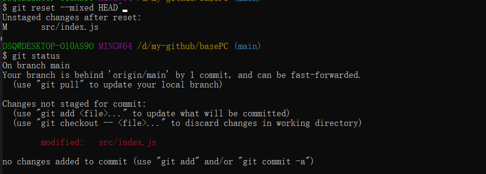
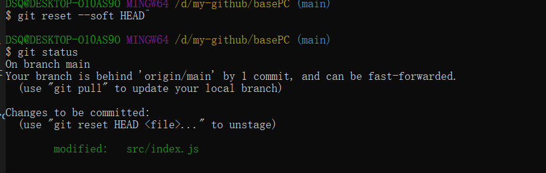
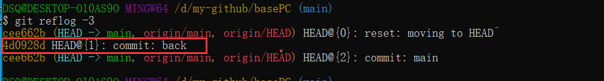

# 版本控制

#### 初始化一个git仓库
~~~
$ git init
~~~

#### 添加文件到git仓库暂存区

~~~
$ git add src/index.js src/goods.js  # 添加多个

$ git add src/index.js               # 添加一个

$ git add .                          # 添加所有
~~~

~~~
$ git add -A 表示添加所有内容 

$ git add . 表示添加新增和修改的文件，不包括删除的文件

$ git add -u 表示添加编辑和删除的文件，不包括新增文件
~~~
git add可以反复多次使用，添加多个文件，git commit可以一次提交很多文件，-m后面输入的是本次提交说明。


#### 查看工作区状态  
~~~
$ git status
~~~

#### 工作区、暂存区、版本库

#### 针对工作区文件修改的回退  
~~~
$ git checkout -- <filename> <filename> ....
~~~

#### 针对提交到缓存区(即add操作)的回退   
~~~
1、全部回退

$ git reset HEAD

2、某个文件的回退

$ git reset HEAD <filename>   # 如：git reset HEAD src/index.js
~~~

#### 针对git本地仓库的版本回退(即git commit后)
~~~
$ git reset --hard HEAD^
~~~
返回上一个版本，在git中`HEAD`表示当前版本，上一个版本`HEAD^`,上上个版本`HEAD^^`, 往前100个版本 `HEAD~100`

回退到指定版本：
~~~
git reset --hard commit_id  # commit_id是版本号，用SHA1计算出来的序列
~~~

关于 [--hard | --soft | -- mixed ]的区别  

    --mixed               reset HEAD and index
    --soft                reset only HEAD
    --hard                reset HEAD, index and working tree
    --merge               reset HEAD, index and working tree
    --keep                reset HEAD but keep local changes

    默认--mixed
<div align="left"></div>

`--hard `  
reset HEAD, index and working tree   
~~~
1、修改src/index.js文件

2、提交到暂存区 git add .

3、提交到git本地仓库 git commit -m "version1"

4、此时 git log -2 可以查看到最新的提交记录

5、git reset --hard HEAD^ 则回退到上一个版本
   1、commit撤回
   2、暂存区撤回 git reset HEAD <filename>
   3、工作区撤回 git checkout -- <filename>
~~~


`--mixed`  
reset HEAD and index
```
5、git reset --soft HEAD^ 则回退到上一个版本
   1、commit撤回
   2、暂存区撤回 git reset HEAD <filename>
   3、工作区不撤回
```
<div align="left"></div>


`--soft`  
reset only HEAD  
```
5、git reset --soft HEAD^ 则回退到上一个版本
   1、commit撤回
   2、暂存区不撤回
   3、工作区不撤回
```
<div align="left"></div>

#### git回退远程仓库版本
先本地回退，然后发布到远程仓库

`--hard:` 回退时本地修改的文件同时被回退(因此修改的代码就没了)
~~~
1、git reset --hard HEAD^   # 本地版本回退

2、git push -f   # 发布到远程
~~~

`--mixed:` 回退时本地修改的文件回到工作区，之前的修改依然存在, 因此错误的提交修改后仍然可以再次提交(推荐)

~~~
1、git reset --mixed HEAD^   # 本地版本回退

2、git push -f   # 发布到远程
~~~

`--soft:` 回退时，本地修改的文件会撤回到暂存区，可以通过`git reset HEAD`将暂存区的文件回退到工作区，修改后，再次提交

~~~
1、git reset --soft HEAD^   # 本地版本回退

2、git push -f   # 发布到远程
~~~

#### 向前恢复
比如回退后又后悔了想恢复之前的版本

使用`git reset --hard HEAD^`回退后想恢复之前的版本

~~~
1、查看历史版本记录

$ git reflog -3  

可以看到back的commit_id = ^4d0928d
~~~
<div align="left"></div>

~~~
$ git reset --hard 4d0928d # 此时HEAD重新指向back版本

# 版本控制就像是一个版本串，HEAD指向当前版本，reset命令在版本串上移动HEAD的指向
~~~


#### 文件删除
~~~
删除：git rm <filename>

提交：git commit -m ""
~~~


#### 查看修改内容  
~~~

1、git diff HEAD -- <file> 查看工作区和版本库里面最新版本的区别

2、git diff   # 查看工作区和暂存区的区别

3、git diff --cached 查看暂存区(stage)和分支(master)的区别

~~~
