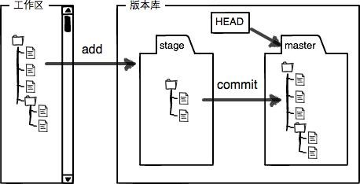

# git配置

#### 基本配置

~~~
$ git config --global user.name "name"
$ git config --global user.email "email.com"
~~~
`git config` 命令的 `--global` 参数表明这台机器上的所有git仓库都使用这个全局的配置，不带`--global`则表示配置改项目

查看配置:
~~~
$ git config --list | -l
~~~

查看某个配置：
~~~
如：$ git config --get user.email
~~~

删除某个配置：
~~~
$ git config --unset [key]
~~~

1.查看用户的配置信息： git config --global --list 要查看当前仓库的，把global改成local就好

2.仓库的 .git/config 只存当前仓库的local配置 而用户的global配置在用户主目录下的 .gitconfig中

#### git中工作区、暂存区、版本库的模型  

#### 忽略文件

.gitignore

将不需要git跟踪的文件或者目录添加到.gitignore文件，改文件要提交到代码块中

#### 配置别名

~~~
git config --global alias.st status

* 后面 git st = git status

git config --global alias.unstage 'reset HEAD'

* 后面从暂存区回退修改文件

git unstage <filename>

~~~
