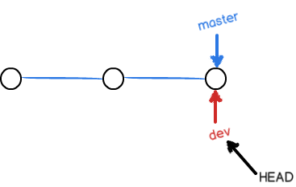
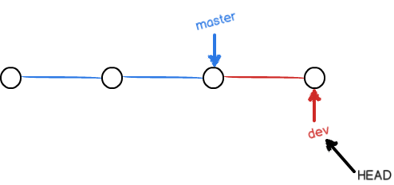
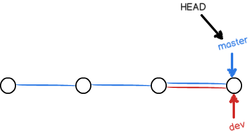
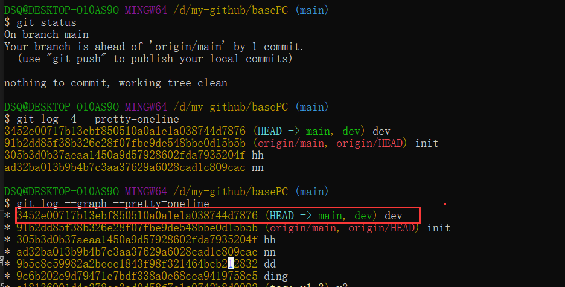
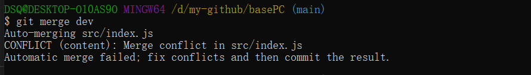
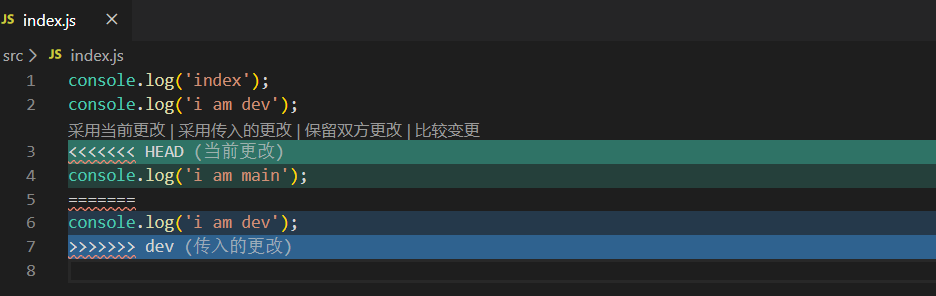
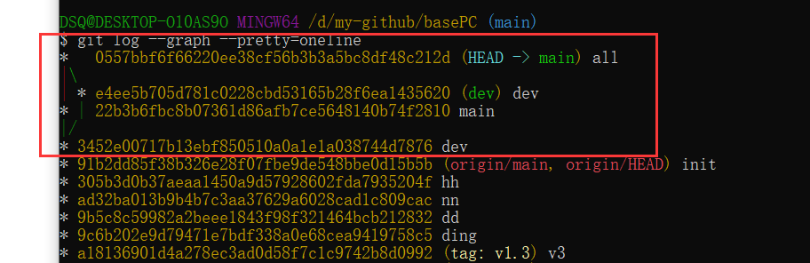
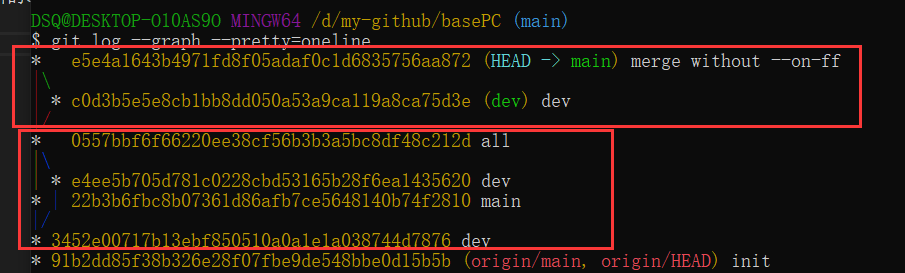
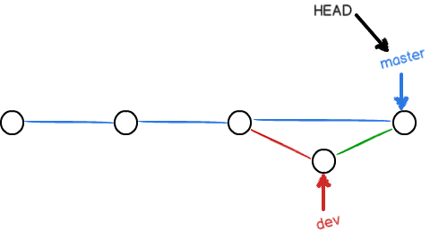

# 分支管理

### 分支合并
廖雪峰老师：https://www.liaoxuefeng.com/wiki/896043488029600/900003767775424

#### 分支合并大致流程
从`master`分支上创建`dev`分支，切换分支`DEAD`指向`dev`分支

在`dev`分支上做一次提交后，`dev`分支往前移动,`master`分支不动

在`dev`分支上完成工作后，合并到`master`分支上，合并完成后，可以删除`dev`分支

删除`dev`分支

 
 

> 实例
~~~
1、创建dev分支

git checkout -b dev

2、在dev分支上修改文件，并commit

3、切换到main分支

4、合并dev到 main: git merge dev

5、合并后发布到远程仓库：git push origin main

6、删除dev分支: git branch -d dev

~~~

从截图上我们看到：  

1、git status 可以看到git merge合并后会自动产生一次提交（`3452e0071b...版本`），因此提示本地仓库比远程仓库多一次提交

2、`git log --graph --pretty=oneline`, 可以看到origin/main依然指向`91b2dd85....` 版本

3、次此合并是`Fast-forward`即`快进模式`， 因此后面再看的时候完成看不出来`3452e0071b...版本`是merge的版本 (后面会讲`--no-ff`参数)

 
 

#### 解决冲突

~~~
1、创建dev分支，同时commit

2、切到main分支，修改相同文件，同时commit

3、合并dev分支到main，此时两次commit因为修改相同文件，就会产出冲突

4、手动解决冲突后，再次commit即可
~~~
合并时提示代码冲突：

`当前更改`为main分支的更改，`传入更改`为被合并的dev分支的更改

此处我们选择`保留双方更改`， `然后git add,  git commit 提交冲突解决后的更改

`git log --graph --pretty=oneline` 查看此时的提交记录(感觉和`git merge --no-ff dev`类似，同样合并后产生一次新的commit，只不过现在我们自己手动提交的, `--no-ff`是自动提交的)

 
 

#### 分支管理策略

> 通常，合并分支时，如果可能，Git会用Fast forward模式，但这种模式下，删除分支后，会丢掉分支信息。如果要强制禁用Fast forward模式，Git就会在merge时生成一个新的commit，这样，从分支历史上就可以看出分支信息。此时用到`--no-ff`模式的`git merge`

~~~
git merge --no-ff -m "merge without --on-ff" dev

git log --graph --pretty=oneline  # 查看分支图

* 因为本次合并会产生新的commit，因此加上`-m`参数，添加描述
~~~

~~~
第一个红框：加了`--no-ff` 参数，dev 分支合并， 然后提交

第二个红框：冲突合并，dev和main分支合并冲突后，再提交(`all`)
~~~

[不带--no-ff参数的log图如上](#base)

不使用`Fast forward`模式，merge后如下：

 
 
 
 

> 合并分支时，加上`--no-ff`参数就可以用普通模式合并，合并后的历史有分支，能看出来曾经做过合并，而`fast forward`合并就看不出来曾经做过合并。

 
 

#### bug分支

> 参考-3.分支

~~~
1、git stash  # 保存工作现场

2、git stash list  # 查看列表

3、git stash apply [stash_id]恢复  git stash drop删除

4、git stash pop  # 恢复的同时 删除保存的临时工作
~~~

> 命令：`git cherry-pick <commit_id>`

场景描述：  
当前在`dev`分支修改东西，此时`main`分支有紧急bug需要修改，新建`bug`分支，`bug`修改完成提交并合并到`main`分支, 因此`dev`分支是从`main`分支创建的，所以`dev`分支也存在同样的bug，此时可以使用`git cherry-pick`将`bug`和`main`合并分支时的commit_id 复制到`dev`分支
