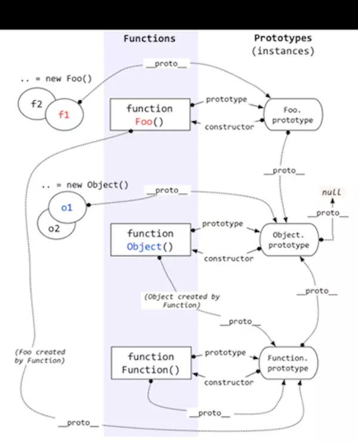

#### typeof

> typeof 操作符返回一个字符串，表示未经计算的操作数的类型。

* `typeof "dong"` => `string`

* `typeof 123` => `number`

* `typeof true` => `boolean`

* `typeof null` =>` object`

* `typeof undefined` => `undefined`

* `typeof function () {}` => `function`

* `typeof class C {}` => `function`

* `typeof Symbol()` => `symbol`

* `typeof 42n` => `bigint`

* `typeof new Date()` => `object`

基本类型：typeof返回：`string`, `number`, `boolean`, `undefind`, `symbol`, `bigint`

引用类型：typeof返回：`function`, `object(除了function, class外，其他的数组，对象，null, Date() 都返回object)`

 

因为数组，null，对象，日期对象等都返回`object`, 可以通过`Object.prototype.toString.call(x)`来区分, 其他的用`typeof`就可以查看到具体类型。

~~~js
Object.prototype.toString.call({}) // [object Object]

Object.prototype.toString.call(null) // [object Null]  

Object.prototype.toString.call([1, 2]) // [object Array]

Object.prototype.toString.call(new Date()) // [object Date]
~~~

如果想判断object的具体是属于那个类型可以使用：`instanceof`

 

#### instanceof

`instanceof`关键字是通过`原型链`判断某个对象是不是另一个对象的实例。

`A instanceof B`: 如果A是B的实例，则返回true，否则返回false  

~~~js
class Parent {
  constructor(x) {
    this.x = x;
  }
}

class Point extends Parent{
  constructor(x, y) {
    super(x);
    this.y = y;
  }
}

const p = new Point(1, 2);

console.log(p instanceof Point); // true
console.log(p instanceof Parent); // true
console.log(p instanceof Object); // true

// 原型链
console.log(p.__proto__ === Point.prototype); // true
console.log(Point.prototype.__proto__ === Parent.prototype); // true
console.log(Parent.prototype.__proto__ === Object.prototype); // true
console.log(Object.prototype.__proto__); // null

// 构造函数
console.log(Point.prototype.constructor === Point); // true
console.log(Parent.prototype.constructor === Parent); // true
~~~

上面代码中`原型链`可以看到js中的`原型继承`，所有对象都继承了`Object.prototype`。

`instanceof`的原理就是上面所说的`原型继承链`。

 

> 如下`原型继承链`

* f1.\_\_proto\_\_  === Foo.prototype

* Foo.prototype.constructor = Foo

* f1.\_\_proto\_\_.constructor = Foo

