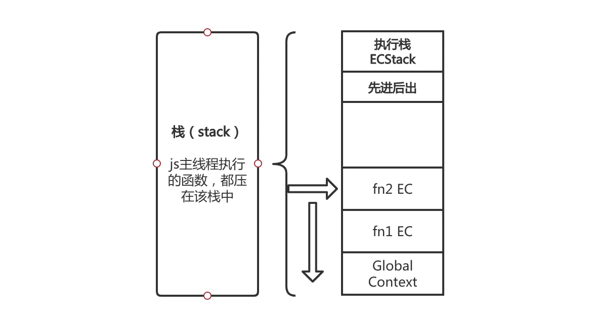

执行上下文也叫执行上下文环境，是js代码被解析和执行时所在环境的抽象概念，javascript任何的代码都是在执行上下文中运行，函数的每次运行都生成，并且独一无二，函数运行结束销毁。

执行上下文三种类型：  

* `全局执行上下文`：这是默认的，最基础的执行上下文，不在任何函数中的代码都位于去全局执行上下文中。

* `函数执行上下文`：每次调用函数时，都会为该函数创建一个新的执行上下文，一个程序中可以存在任意数量的函数执行上下文，每当一个新的执行上下文被创建，它都会按照特定的顺序执行一系列步骤。

* `eval执行上下文`：运行在`eval`函数中的代码获得了自己的执行上下文。

在代码执行前：

* 变量、函数表达式， 变量声明默认为undefined

* this - 赋值

* 函数声明 - 赋值

这三种数据的准备情况被称为`执行上下文`或者`执行上下文环境`。

#### 执行栈

在具体谈执行上下文时，我们先来简单了解下`执行栈`,`执行栈`在其他编程语言中也被叫做`调用栈`，具有 `LIFO（后进先出）结构`，用于存储在`代码执行期间创建的所有执行上下文`。
当 JavaScript 引擎首次读取你的脚本时，它会创建一个`全局执行上下文`并将其推入当前的执行栈。每当发生一个函数调用，引擎都会为该函数创建一个`新的执行上下文`并将其推到当前执行栈的顶端。引擎会运行执行上下文在执行栈顶端的函数，当此函数运行完成后，其对应的执行上下文将会从执行栈中弹出，栈顶指针下移，上下文控制权将移到当前执行栈的下一个执行上下文。

> 实例

~~~js
function fn1() {  
  fn2();   
  console.log('fn1 函数执行上下文'); 
}

function fn2() {  
  console.log('fn2 函数执行上下文');  
}

fn1();
console.log('Global 全局执行上下文');
~~~

javascript引擎首先会创建一个`全局执行上下文`并将它推入到当前的`执行栈`，当调用`fn1`函数时，javascript引擎为该函数创建一个`新的执行上下文`并将其推到`当前执行栈顶端`，当在`fn1`函数中调用`fn2`时，javascript引擎为该函数创建一个`新的执行上下文`，并将其推到`当前执行栈顶端`，当`fn2`函数执行完成后，它的执行上下文从当前`执行栈`中弹出，上下文控制权将移到当前执行栈的下一个`执行上下文`，即`fn1`函数的执行上下文，当`fn1`函数执行完成后，它的执行上下文从当前执行栈中弹出，上下文控制权移到`全局执行上下文`，一旦所以代码执行完毕，javascript引擎把`全局执行上下文`从`执行栈`中移除。

#### 全局执行上下文

javascipt引擎：

* 创建上下文

* 执行上下文

`全局执行上下文`包含至少：一个`全局对象`和`this变量`, `this`会引用全局对象，在浏览器执行时则全局对象是`Window`,在node环境中执行时则全局对象是`Global`。

每个执行上下文都有两个独立的阶段 - `创建阶段`和`执行阶段`，可以看到当代码还没执行到定义变量和函数位置的时候，变量和函数已经被声明了，只是变量的初始值为`undefined`,而函数在未执行的时候已经在内存中开辟了空间并将引用给了函数的声明。

##### 创建阶段 

* 创建全局对象(Window | Global)

* 创建this对象(Window | Global)

* 创建作用域链

* 在内存中放置所有函数声明，变量声明并且默认赋值`undefind`(变量提升，块级作用域let，const不存在变量提升，而是绑定在暂时性死区)。

##### 执行阶段

javascript引擎才会开始一行一行的执行代码，并为执行到的变量赋值。

#### 函数执行上下文

`函数执行上下文`和`全局执行上下文`几乎相同，在函数调用的时候创建，不同点是他不会创建全局对象，而是会创建一个参数对象(arguments)

