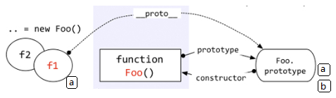
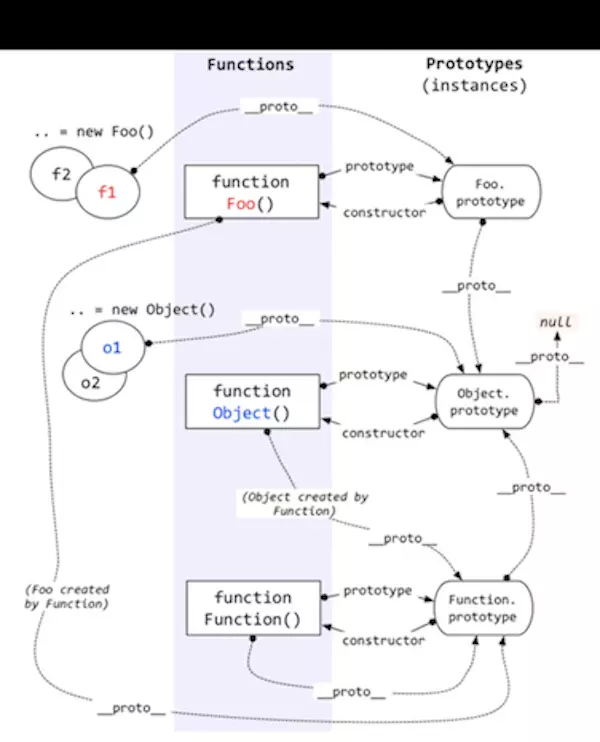
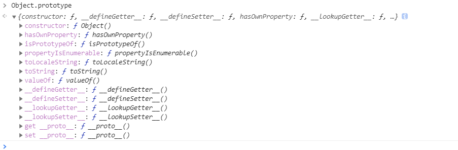

#### 原型和原型链

javascript中的继承是通过`原型链`来实现的

~~~js
function Foo() {

}

const f = new Foo();

f.a = 10;

Foo.prototype.a = 100;
Foo.prototype.b = 200;

console.log(f.a);
console.log(f.b);
// 10, 200
~~~

上面的`f.b`属性是怎么来的，从`Foo.prototype`继承来的，因为`f.__proto__` => `Foo.prototype`   

`访问一个对象的属性时，先在基本属性查找，如果没用，再沿着__proto__这条链向上找 —— 原型链`

> 如何区分是否未继承属性：`Object.hasOwnProperty()`

~~~js
f.hasOwnProperty('a') // true

f.hasOwnProperty('b') // false
~~~

 

> 原型和原型链分析： 

* 所有的`function`的原型都是`Function.prototype`, 因此所有函数都有`apply`,`call`, `bind`, `length`, `arguments`, `caller`等方法和属性。

* `Function.prototype.__proto__ === Object.prototype`, `Object.prototype.__proto__ === null`, Function的原型继承Object，因此函数有Object原型上继承的方法，如`hasOwnProperty`, `isPrototypeOf`, `propertyIsEnumerable`, `toString`, `valueOf`等属性和方法。

Object上定义的原型属性和方法：（所有对象都继承的）

 

#### js继承

`面向对象语言`支持两种继承方式：`接口继承`和`实现继承`，比如java,  `接口继承只继承方法签名，而实现继承则继承实际方法`。在javascript中由于函数没用签名所以无法实现接口继承，只支持实现继承，而js中主要是通过`原型链`来实现。

> 利用`原型`让一个引用类型继承另一个引用类型的属性和方法。

`构造函数`，`原型`，`实例`的关系：每个构造函数都有一个`prototype`属性指向一个对象(这个对象就是构造函数的原型对象), 原型对象有一个`constructor`属性该属性指向一个构造函数；而实例中包含一个指向原型对象的内部指针`__proto__`。

原型链的构建就是通过将一个类型的实例赋值给另一个构造函数的原型实现的。

~~~js
function T1() {
  this.a = 'dong';
}

function T2() {
  this.b = 'shao';
}

function T3() {
  this.c = 'qiang';
}

// t3.__proto__ = T3.prototype = t2
// t2.__proto__ = T2.prototype = t1
// t1.__proto__ = T1.prototype
// t3.__proto__.__proto__.__proto__ == T1.prototype 原型链

const t1 = new T1();

T2.prototype = t1;

const t2 = new T2();

T3.prototype = t2;

const t3 = new T3();
console.log(t3.a);
console.log(t3.b);
console.log(t3.c);
console.log(t3 instanceof T3);
console.log(t3 instanceof T2);
console.log(t3 instanceof T1);
// dong、shao、qiang
// true, true, true
~~~

#### 实现继承的六种方式  

##### Object.create()方法

`Object.create()`方法创建一个新对象，使用现有的对象来提供创建对象的`__proto__`，返回一个新对象，带着指定的原型对象和属性。

~~~js
Object.create(proto，[propertiesObject])

// proto: 新创建对象的原型对象
// propertiesObject: 可选，需要传入一个对象，该对象参照`Object.defineProperties()`的第二个参数。
~~~

~~~js
function SuperType (name) {
  this.name = name;
  this.colors = ["red", "blue", "green"];
}
SuperType.prototype.sayName = function () {
  return this.name;
};

const t = Object.create(new SuperType('dong'));

console.log(t.name);
console.log(t.colors);
console.log(t.sayName());
console.log(t instanceof SuperType);

// dong
// [ 'red', 'blue', 'green' ]
// dong
// true
~~~

##### 1、原型链  

`将父类的实例作为子类的原型`

参考上面的js代码，就是原型链继承。利用原型，让一个引用类型继承另一个引用类型的属性及方法。

优点：

继承了父类的模板，又继承了父类的原型对象。

缺点：

* 无法实现多继承

* 创建子类实例时，无法向父类构造函数传参数。

##### 2、构造函数

`在子类的构造函数内部调用父类的构造函数`

~~~js
function SuperType (name) {
  this.name = name;
}
SuperType.prototype.sayName = function () {
  return this.name;
};

function SuperType1 (name) {
  this.supName = name;
}

// 实现多继承
function SubType () {
  // 此时SuperType的上下文对象this是SubType的实例
  SuperType.apply(this, [...arguments]);
  // 或者 SuperType.call(this, ...arguments);
  SuperType1.call(this, ...arguments);
  this.subName = "SubType";
};

let instance = new SubType('SuperTYpe');

console.log(instance.name);
console.log(instance.subName);
console.log(instance.supName);
~~~

优点：

* 可以实现多继承

* 创建子实例时，可以向父类传递参数

缺点：

* 实例并不是父类的实例，只是子类的实例

* 只能继承父类的属性和方法，不能继承原型属性和方法。

* 无法实现函数复用，每个子类都有父类实例的函数副本，影响性能。

##### 3、 组合继承(组合使用原型链和构造函数)

`组合使用原型链继承和构造函数继承的优点，使用原型链继承使用对原型属性和方法的继承，通过构造函数继承来实现对实例属性的继承`。

~~~js
function SuperType (name) {
  this.name = name;
  this.colors = ["red", "blue", "green"];
}
SuperType.prototype.sayName = function () {
  return this.name;
};

// 构造函数继承
function SubType (name, subName) {
  SuperType.call(this, name);
  this.subName = subName;
};

// 原型链继承
SubType.prototype = 
// 修补constructor的指向
SuperType.prototype.constructor = SuperType;

const instance = new SuperType('sup', 'sub');

console.log(instance.name);
console.log(instance.sayName());
~~~

组合多继承：
~~~js
function SuperType (name) {
  this.name = name;
  this.colors = ["red", "blue", "green"];
}
SuperType.prototype.sayName = function () {
  return this.name;
};

function SuperType1 (name) {
  this.name = name;
  this.colors = ["red", "blue", "green"];
}
SuperType1.prototype.sayName = function () {
  return this.name;
};

// 构造函数继承
function SubType (name1, name2, subName) {
  SuperType.call(this, name1);
  SuperType1.call(this, name2);
  this.subName = subName;
};

// 原型链继承
SubType.prototype = Object.create(SuperType.prototype);
// 混入
Object.assign(SubType.prototype, SuperType1.prototype);
// 修补constructor的指向
SuperType.prototype.constructor = SuperType;

const instance = new SuperType('sup', 'sub');

console.log(instance.name);
console.log(instance.sayName());
~~~

##### 4、 原型式继承

##### 5、 寄生式继承

##### 6、 寄生组合式继承(组合使用组合继承和寄生式继承)

