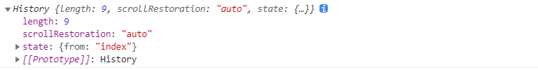
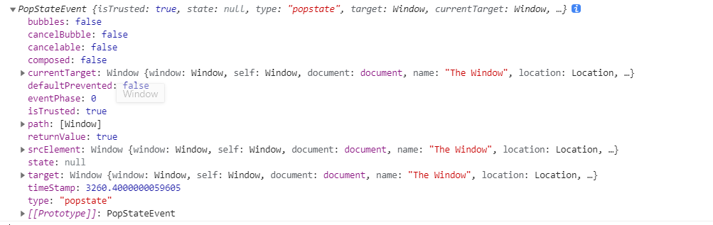
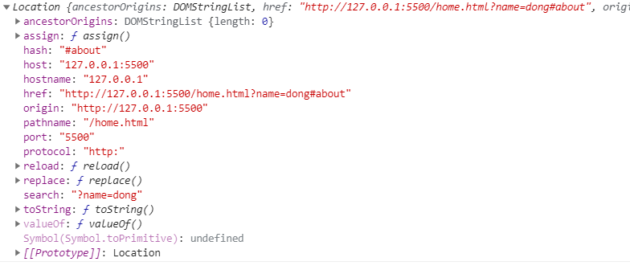

[History API](https://developer.mozilla.org/zh-CN/docs/Web/API/History)

window 的`history对象`提供了对`浏览器会话历史`的访问，它暴露了很多有用的方法和属性，允许用户在浏览历史中向前向后跳转，根据通过history内部维护一个会话记录`allKeys`

`back()` `forward()` `go()` 方法用来完成在用户历史记录的向前向后跳转，同时会触发`popstate`事件，在单页应用中可以监听路由改变，根据url匹配显示不同的组件。

**注意**:  `history.back()` `history.forward()` `history.go()`改变浏览器的url，但是不会刷新页面。

`属性`：

`1. history.length`: 返回一个整数，该整数表示会话历史中元素的数目，包括当前加载的页。

`2. history.scrollRestoration`: 允许Web应用程序在历史导航上显式地设置默认滚动恢复行为。此属性可以是自动的（auto）或者手动的（manual）。
 
 * `auto`: 将恢复用户已滚动到的页面上的位置

 * `manual`: 未还原页面上的位置，需要用户手动恢复

`3. history.state`: 直接通过history.state查看当前history栈顶部的记录的state，只有进行`pushState`和`replaceState`后才会有state，否则为`null`

 

`方法`：

`1. history.back()`: 在浏览器历史记录里前往上一页, 用户可点击浏览器左上角的返回, 等价于 history.go(-1).

`2. history.forward()`: 在浏览器历史记录里前往下一页，用户可点击浏览器左上角的前进, 等价于 history.go(1).

`3. history.go(n)`: 在浏览器历史记录中向上或者向下翻页

`4. history.pushState()`: 按指定的名称和URL（如果提供该参数）将数据push进会话历史栈

~~~js
history.pushState(state, title[, url])
~~~

* `state`: 状态对象可以是任何可以序列化的对象。

* `title`: 一般设置为null

* `url`: 新历史记录条目的URL由此参数指定。 请注意，浏览器不会在调用pushState() 之后尝试加载此URL，但可能会稍后尝试加载URL，例如在用户重新启动浏览器之后。 新的URL不必是绝对的。 如果是相对的，则相对于当前URL进行解析。 新网址必须与当前网址相同 origin； 否则，pushState()将引发异常。 如果未指定此参数，则将其设置为文档的当前URL。

`5. history.replaceState()`: 跟`history.pushState()`类似，只是不向历史会话记录添加新记录，而是替换当前记录。

 

### popstate事件和hashChange事件

`popstate事件`:

其中`event.type = popstate`

~~~js
window.addEventListener('popstate', function(event){
  console.log(event);
});

window.onpopstate = function(event) {
  console.log(event);
}
~~~

 
 

`hashchange事件`：

~~~js
window.addEventListener('hashchange', function(event){
  console.log(event);
});

window.onhashchange = function(event) {
  console.log(event);
}
~~~

事件内容如下：

其中：`newURL`为新的url，`oldURL`为之前的url，`event.type = hashchange`

 
 

**两个事件的触发时机：**

* `pushState`, `replaceState`, `back`, `forword`, `go` 都会修改页面url，但是不会刷新页面，即不会向服务器请求页面。

* `back`, `forword`, `go`会触发`popstate事件`,  `a标签`同样会触发`popstate`事件

* `window.location.href = `, `window.location.replace()` 都会改变url，同时向服务器发起请求，请求页面

 

### Location对象

当前页面url： `http://127.0.0.1:5500/home.html?name=dong#about`

`window.location对象如下`：

方法：都会改变url，同时向服务器发起请求，请求页面
* `window.location.href =`

* `window.location.replace()`
