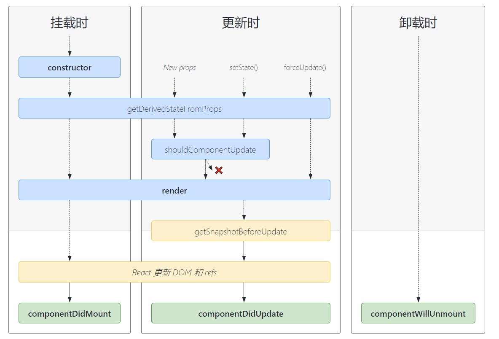

#### class组件基本形式

~~~js
class Clock extends React.Component {
  constructor(props) {
    super(props);
    this.state = {date: new Date()};
  }

  componentWillReceiveProps(props, state) {}

  getDerivedStateFromProps(props, state) {}

  componentWillMount() {}

  componentDidMount() {}

  componentWillUpdate() {}

  componentDidUpdate() {}

  componentDidCatch() {}

  render() {
    return (
      

        <h1>Hello, world!</h1>
        <h2>It is {this.state.date.toLocaleTimeString()}.</h2>
      

    );
  }
}
~~~

 

#### 老版本的组件生命周期

`1、组件初始化`

~~~js
constructor -> componentWillMount -> render -> componentDidMount
~~~

* `constructor，componentWillMount`: 组件没有挂载到页面DOM上，因此无法访问DOM结构

* `render`: 将虚拟DOM生成真是的DOM，并挂载到页面

* `componentDidMount`: DOM生成后，可以访问页面的DOM结构

 

`2、组件更新state`

~~~js
componentWillUpdate -> render -> componentDidUpdate
~~~

处理setState不能立即更新：

* 回调函数

* componentDidUpdate

`setState()`并不总是立即更新组件。它会批量推迟更新。这使得在调用`setState()`后立即读取`this.state`成为了隐患。为了消除隐患，请使用`componentDidUpdate`或者`setState`的回调函数（`setState(updater, callback)`），这两种方式都可以保证在应用更新后触发

 

`3、组件更新props`

~~~js
componentWillReceiveProps -> componentWillUpdate  -> render -> componentDidUpdate
~~~

 

注意：其中`componentWillMount，componentWillUpdate，componentWillReceiveProps`已经废弃

 

#### 新版本生命周期

生命周期示意图：

 

`1、挂载时`

~~~js
constructor -> static getDerivedStateFromProps(props, state) -> render -> componentDidMount
~~~

 

`2、更新state或props`

~~~js
getDerivedStateFromProps(props, state) -> shouldComponentUpdate(nextProps, nextState) ->  render -> getSnapshotBeforeUpdate(prevProps, prevState) -> componentDidUpdate
~~~

 

`3、组件卸载`

~~~js
componentWillUnmount
~~~

 

#### 错误处理

当`渲染过程`，`生命周期`，或`子组件的构造函数`中抛出错误时，会调用如下方法：

* static getDerivedStateFromError()

* componentDidCatch(error, info)

~~~js
class ErrorBoundary extends React.Component {
  constructor(props) {
    super(props);
    this.state = { hasError: false };
  }

  static getDerivedStateFromError(error) {
    // 更新 state 使下一次渲染可以显降级 UI
    return { hasError: true };
  }

  render() {
    if (this.state.hasError) {
      // 你可以渲染任何自定义的降级  UI
      return <h1>Something went wrong.</h1>;
    }

    return this.props.children;
  }
}
~~~

 

#### 生命周期介绍

`1、constructor(props)`

注意在构造函数中，不能使用`this.setState()`, 不能用`props`初始化`state`
应该放在`static getDerivedStateFromProps(props, state)`方法中。

* 设置state `this.state = {...}`

* 创建 ref `const nodeRef = React.createRef()`

* 方法绑定 `this.func = this.function.bind(this)`

 

`2、static getDerivedStateFromProps(props, state)`

使用`props`初始化`state`, 让`props`改变的时候，能够更新`state`更新组件

它应返回一个对象来更新`state`，如果返回`null`则不更新任何内容。

最常见的误解就是: `getDerivedStateFromProps` 和 `componentWillReceiveProps` 只会在 `props `改变时才会调用。实际上`只要父级重新渲染时，这两个生命周期函数就会重新调用`，不管 `props` 有没有变化。

 

`3、render， componentDidMount`

* 访问 DOM 节点

* 添加事件侦听器

* 请求后台接口

 

`4、shouldComponentUpdate(nextProps, nextState)`

可以将`this.props`与`nextProps`以及`this.state`与`nextState`进行比较，并返回`false`以告知 React 可以跳过更新。请注意，返回 false 并不会阻止子组件在 state 更改时重新渲染。

 

`5、getSnapshotBeforeUpdate(prevProps, prevState)`

`getSnapshotBeforeUpdate()`在最近一次渲染输出（提交到 DOM 节点）之前调用。它使得组件能在发生更改之前从 DOM 中捕获一些信息（例如，滚动位置）。`此生命周期的任何返回值将作为参数传递给 componentDidUpdate()`。

 

`6、componentDidUpdate(prevProps, prevState, snapshot)`

`componentDidUpdate()` 会在更新后会被立即调用。首次渲染不会执行此方法。

如果组件实现了`getSnapshotBeforeUpdate()`生命周期（不常用），则它的返回值将作为 `componentDidUpdate()` 的第三个参数`snapshot`参数传递。否则此参数将为`undefined`。

当组件更新后，可以在此处对 DOM 进行操作。如果你对更新前后的 props 进行了比较，也可以选择在此处进行网络请求。

~~~js
componentDidUpdate(prevProps) {
  // 典型用法（不要忘记比较 props）：
  if (this.props.userID !== prevProps.userID) {
    this.fetchData(this.props.userID);
  }
}
~~~