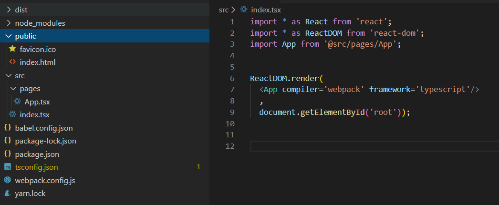

#### 目录结构

 

#### 流程

1、安装依赖

安装webpack相关依赖：

~~~js
yarn add webpack webpack-cli webpack-dev-server --dev

yarn add html-webpack-plugin --dev // 用于将webpack编译生成的bundle.js引入到index.html

yarn add @types/webpack
~~~

安装react相关依赖：

~~~js
yarn add react react-dom

// 安装react和react-dom的声明文件，以获得编写代码时更好的提示
yarn add @types/react @types/react-dom ---dev
~~~

安装typescript相关依赖：

~~~js
yarn add typescript awesome-typescript-loader --dev
~~~

`awesome-typescript-loader`可以让webpack使用typescript的配置文件`tsconfig.json`编译ts代码。

 

2、`tsconfig.json`基本配置

~~~json
{
    "compilerOptions": {
        "outDir": "./dist/", // 编译输出目录
        "sourceMap": true,  // 生成映射文件，配合webpack的 devtool: "source-map"来生成项目的映射文件便于在浏览器调试。 
        "noImplicitAny": true, // 不能包含隐式的any
        "module": "commonjs", // 编译为commmonjs规范的模块
        "target": "es5", // 代码编译成es5
        "jsx": "react" //  用于指定按照何种方式生成jsx代码，可选react, preserve,react-native
    },
    "include": [
        "./src/**/*" // 指定范围：src目录下的所有文件
    ]
}
~~~

 

3、`webpack`配置

`需要在public文件夹下创建index.html`

~~~js
const path = require('path');
const HtmlWebpackPlugin = require('html-webpack-plugin');

module.exports = {
  mode: 'development',
  entry: './src/index.tsx',
  output: {
    filename: '[name].[hash:8].js',
    path: path.join(__dirname, 'dist'),
  },
  devtool: "source-map", // 与tsconfig.json的sourceMap: true配合生成映射文件便于代码调试
  resolve: {
    extensions: ['.ts', '.tsx', '.jsx', '.js'],
    modules: ['node_modules', path.join(__dirname, './src/')],
    alias: {
      '@src': path.join(__dirname, 'src')
    }
  },
  module: {
    rules: [
      // {  因为target: es5 因此不需要再使用babel-loader再转换js代码
      //   test: /\.jsx?$/,
      //   include: path.resolve(__dirname, './src'),
      //   exclude: /node_modules/,
      //   enforce: "pre",
      //   use: [
      //     { loader: 'babel-loader' }
      //   ]
      // },
      {
        test: /\.tsx?$/,
        exclude: '/node_modules/',
        use: [
          {
            loader: 'awesome-typescript-loader',
            options: {}
          }
        ],
      },
    ]
  },
  externals: {
    "react": "React",
    "react-dom": "ReactDOM"
  },
  plugins: [
    new HtmlWebpackPlugin({
      template: path.join(__dirname, '/public/index.html'),
      favicon: path.join(__dirname, '/public/favicon.ico'),
    })
  ]
}
~~~

 

3. 编写组件

~~~js
// App.tsx
import * as React from 'react';

export interface HelloProps {
  compiler: string;
  framework: string;
};

// 函数组件
function Hello(props: HelloProps) {
  return (
    <h1>Hello from {props.compiler} and {props.framework}!</h1>
  );
}

// 类组件
class HelloClass extends React.Component<HelloProps, {}> {
  render() {
    return (
      <h1>Hello from {this.props.compiler} and {this.props.framework}!</h1>
    )
  }
}

export default HelloClass;
~~~

~~~js
// index.tsx引入
import * as React from 'react';
import * as ReactDOM from 'react-dom';
import App from '@src/pages/App';

ReactDOM.render(
  <App compiler='webpack' framework='typescript1'/>
  , 
  document.getElementById('root'));
~~~

 

4、使用`webpack-dev-server`启动项目

获取更好的热更新体验

`package.json`的`scripts`添加`"dev": "webpack-dev-server --config ./webpack.config.js"`

`yarn dev`启动项目即可。

