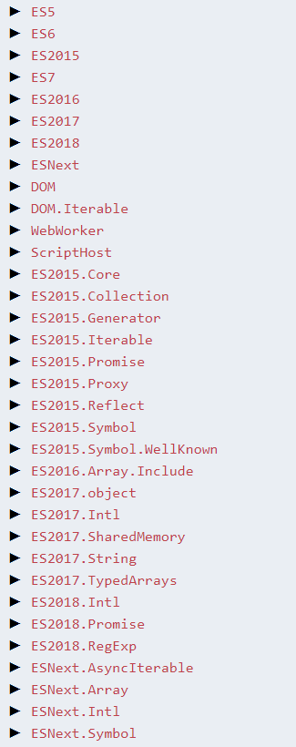

#### ts编译上下文

配置介绍：

`tsc`命令， 可以通过`-p`指定项目的根路径，同时也是`tsconfig.json`位置， 命令行指定时忽略tsconfig.json文件
如果直接在项目的根目录下输入tsc , `则目录下的所有的.ts 文件被编译为.js文件`。

`tsc -w`: 监控文件变化，自动编译文件，可以通过`watchOptions`自定义配置。

~~~json
{
  "compilerOptions": {},
  "include": [],
  "exclude": [],
  "files": [],
  "extends": "",
  "watchOptions": {},
  "buildOptions": {},
  "compileOnSave":true
}
~~~

`一、compileOnSave:` boolean

用于启用保存时自动编译功能。

`files:` string[]

`二、files: ["index.ts", "src/**/*"]`

用于指定一个包含`相对或者绝对文件路径的列表`，当files属性不存在时，编译器会编译当前目录和子目录中的所有文件。当files属性存在是，仅仅是编译files列表中的文件。

* `如果同时指定了exclude和files，则files属性优先`。

* `如果同时指定了include和files, 则要编译的文件为两种指定范围的合集 files & include`。

* `如果同时指定include和exclude, 则交集部分的文件会被排除`。

* `exclude默认情况下会排除node_modules，bower_components，jspm_packages和<outDir>目录`

* `使用compilerOptions:outDir 指定的编译文件输出目录，会被排除`

`三`、`include`、`exclude`: string[]

`exclude默认情况下会排除node_modules，bower_components，jspm_packages和<outDir>目录`

指定一个`文件glob匹配模式列表`，支持的glob通配符有:

*  `*` 匹配0或多个字符（不包括目录分隔符）

* `**/` 递归匹配任意子目录

* `?` 匹配一个任意字符（不包括目录分隔符）

如果一个glob模式里的某部分只包含`*`或`.*`，那么仅有支持的文件扩展名类型被包含在内（`比如默认.ts，.tsx，和.d.ts`， 如果 `allowJs`设置能true还包含`.js和.jsx`）。

`四、extends`: string  

`tsconfig.json`文件可以利用`extends`属性从另一个配置文件里继承配置, `extends`的值是一个字符串，包含指向另一个要继承文件的路径。

默认`json`文件。

~~~json
{
  "compilerOptions": {
    "outDir": "dist"
  },
  "extends": "./tt",
  "watchOptions": {},
  "buildOptions": {},
}
~~~

`五、watchOptions`： {}

`tsc --watch`: 即可开启文件监听自动编译模式。

`TypeScript 3.8` 在 tsconfig.json中添加了一个新的`watchOptions`字段，它可以让使用者告诉编译器/语言服务，应该使用哪种`监听策略来跟踪文件或目录`, 包括四个选项。

`watchFile:` 监听单个文件的策略，它可以有以下值

* `fixedPollingInterval`: 以固定的时间间隔，检查文件的更改

* `priorityPollingInterval`: 以固定的时间间隔，检查文件的更改，但是使用「启发法」（heuristics）检查某些类型的文件的频率比其他文件低

* `dynamicPriorityPolling`: 使用动态队列，在该队列中，较少检查不经常修改的文件

* `useFsEvents`: 默认），尝试使用操作系统/文件系统原生事件来监听文件更改

* `useFsEventsOnParentDirectory`: 尝试使用操作系统/文件系统原生事件来监听文件、目录的更改，这样可以使用较小的文件监听程序，但是准确性可能较低

`watchDirectory:` 在缺少递归文件监听功能的系统中，使用哪种策略监听整个目录树

* `fixedPollingInterval`: 以固定的时间间隔，检查目录树的更改

* `dynamicPriorityPolling`: 使用动态队列，在该队列中，较少检查不经常修改的目录

* `useFsEvents`: （默认），尝试使用操作系统/文件系统原生事件来监听目录更改

`fallbackPolling:` 当使用文件系统的事件，该选项用来指定使用特定策略

* `fixedPollingInterval`

* `priorityPollingInterval`

* `dynamicPriorityPolling`

`synchronousWatchDirectory`: 在目录上禁用延迟监听功能。在可能一次发生大量文件（如 node_modules）更改时，它非常有用，但是你可能需要一些不太常见的设置时，禁用它。

`六、buildOptions:` {}

* `verbose`: boolean

* `dry`: boolean

* `force`: boolean

* `incremental`: boolean

* `traceResolution`: boolean

* `assumeChangesOnlyAffectDirectDependencies`: boolean

`七、compilerOptions:` 编译选项

参考：https://www.tslang.cn/docs/handbook/compiler-options.html

~~~js
{
  "compilerOptions": {

    /* 基本选项 */
    "target": "es5",                       // 指定 ECMAScript 目标版本: 'ES3' (default), 'ES5', 'ES6'/'ES2015', 'ES2016', 'ES2017', or 'ESNEXT'
    "module": "commonjs",                  // 指定使用模块: 'commonjs', 'amd', 'system', 'umd' or 'es2015'
    "lib": [],                             // 指定要包含在编译中的库文件
    "allowJs": true,                       // 允许编译 javascript 文件
    "checkJs": true,                       // 报告 javascript 文件中的错误
    "jsx": "preserve",                     // 指定 jsx 代码的生成: 'preserve', 'react-native', or 'react'
    "declaration": true,                   // 生成相应的 '.d.ts' 文件
    "sourceMap": true,                     // 生成相应的 '.map' 文件
    "outFile": "./",                       // 将输出文件合并为一个文件
    "outDir": "./",                        // 指定输出目录
    "rootDir": "./",                       // 用来控制输出目录结构 --outDir.
    "removeComments": true,                // 删除编译后的所有的注释
    "noEmit": true,                        // 不生成输出文件
    "importHelpers": true,                 // 从 tslib 导入辅助工具函数
    "isolatedModules": true,               // 将每个文件作为单独的模块 （与 'ts.transpileModule' 类似）.

    /* 严格的类型检查选项 */
    "strict": true,                        // 启用所有严格类型检查选项
    "noImplicitAny": true,                 // 在表达式和声明上有隐含的 any类型时报错
    "strictNullChecks": true,              // 启用严格的 null 检查
    "noImplicitThis": true,                // 当 this 表达式值为 any 类型的时候，生成一个错误
    "alwaysStrict": true,                  // 以严格模式检查每个模块，并在每个文件里加入 'use strict'

    /* 额外的检查 */
    "noUnusedLocals": true,                // 有未使用的变量时，抛出错误
    "noUnusedParameters": true,            // 有未使用的参数时，抛出错误
    "noImplicitReturns": true,             // 并不是所有函数里的代码都有返回值时，抛出错误
    "noFallthroughCasesInSwitch": true,    // 报告 switch 语句的 fallthrough 错误。（即，不允许 switch 的 case 语句贯穿）

    /* 模块解析选项 */
    "moduleResolution": "node",            // 选择模块解析策略： 'node' (Node.js) or 'classic' (TypeScript pre-1.6)
    "baseUrl": "./",                       // 用于解析非相对模块名称的基目录
    "paths": {},                           // 模块名到基于 baseUrl 的路径映射的列表
    "rootDirs": [],                        // 根文件夹列表，其组合内容表示项目运行时的结构内容
    "typeRoots": [],                       // 包含类型声明的文件列表
    "types": [],                           // 需要包含的类型声明文件名列表
    "allowSyntheticDefaultImports": true,  // 允许从没有设置默认导出的模块中默认导入。

    /* Source Map Options */
    "sourceRoot": "./",                    // 指定调试器应该找到 TypeScript 文件而不是源文件的位置
    "mapRoot": "./",                       // 指定调试器应该找到映射文件而不是生成文件的位置
    "inlineSourceMap": true,               // 生成单个 soucemaps 文件，而不是将 sourcemaps 生成不同的文件
    "inlineSources": true,                 // 将代码与 sourcemaps 生成到一个文件中，要求同时设置了 --inlineSourceMap 或 --sourceMap 属性

    /* 其他选项 */
    "experimentalDecorators": true,        // 启用装饰器
    "emitDecoratorMetadata": true          // 为装饰器提供元数据的支持
  }
}
~~~

`1、allowJs`: boolean

`默认false`

是否允许编译js文件，默认是不编译js文件的，即js文件不会编译后，输出到指定的输出目录。

`2、checkJs`: boolean

`默认false`

在`.js`文件中报告错误。与`--allowJs`配合使用。

~~~js
// test.js
// 比如下面的错误，如果checkJs: false, 则不会报错，true则报错。
const a = d;
~~~

`3、removeComments`：boolean

`默认false`

删除所有注释，除了以`/!*`开头的版权信息。

`4、noEmitOnError`: boolean

`默认false`

报错时不生成输出文件。

`5、allowUnreachableCode`: boolean

`默认false`

允许执行不到的代码错误。当为false时，下面会报错。

~~~js
function a() {
  while(true) {
    console.log('dd');
  }
  console.log('dd');
}
~~~

`6、allowUnusedLabels`： boolean

`默认false`

是否允许为使用的标签

`7、alwaysStrict`：boolean

`默认false`

以严格模式解析并为每个源文件生成`"use strict"`语句, 会在编译后的每个文件头部加上`"use strict"`

`8、baseUrl`：string

参考模块解析：https://www.tslang.cn/docs/handbook/module-resolution.html

解析非相对模块名的基准目录

~~~json
{
  "compilerOptions": {
    "outDir": "dist",
    "target": "ES5",
    "baseUrl": "./",
    "paths": {
      "@src/*": ["./src/*"],
    }
  },
  "include": ["./index.ts", "./src/**/*"]
}
~~~

~~~js
import { c } from '@src/index'

console.log(c);
~~~

`9、path`: Object

模块名到基于`baseUrl`的路径映射的列表，参考上面。

`10、charset`：string

`默认"utf8"`

输入文件的字符集。

`11、declaration`：boolean

`默认false`

生成相应的`.d.ts`文件, 一个`.ts`文件编译后生成`.js`和`.d.ts`两个文件。

`12、declarationDir`：string

生成声明文件的输出路径(位置)。

`13、diagnostics`：boolean

`默认false`

当为true时，显示编译的一些信息如下：

~~~
Files:              14
Lines:           26272
Nodes:          116008
Identifiers:     42887
Symbols:         29385
Types:            9168
Instantiations:   4754
Memory used:    64788K
I/O read:        0.01s
I/O write:       0.00s
Parse time:      0.32s
Bind time:       0.16s
Check time:      0.72s
Emit time:       0.02s
Total time:      1.22s
~~~

`14、extendedDiagnostics`: boolean

`默认false`

显示详细的诊段信息,比`diagnostics`更为详细的信息。

`15、experimentalDecorators`: boolean

`默认false`

启用实验性的ES装饰器。

`16、target`: string

`默认："ES3"`

指定ECMAScript目标版本 `"ES3"（默认）`， `"ES5"`， `"ES6"/ "ES2015"`， `"ES2016"`， `"ES2017"`或 `"ESNext"`。

`17、module`： string

`target === "ES6" ? "ES6" : "commonjs"`

指定生成哪个模块系统代码： `"None"`， `"CommonJS"`， `"AMD"`， `"System"`， `"UMD"`， `"ES6"`或 `"ES2015"`。

只有 `"AMD"`和 `"System"`能和`--outFile`一起使用。

`18、lib`: string[]

编译过程中需要引入的库文件的列表。

~~~js
// 注意：如果--lib没有指定默认注入的库的列表。默认注入的库为：
// 针对于--target ES5：DOM，ES5，ScriptHost
// 针对于--target ES6：DOM，ES6，DOM.Iterable，ScriptHost
~~~

`如果不想引入标准lib.d.ts可以使用compilerOptions:noLib = true`

比如在代码中使用`Promise`, 当`target: ES5`时，需要指定`lib`导入库，如果`target: ES6`则不需要`lib`

~~~json
{
  "compilerOptions": {
    "outDir": "dist",
    "target": "ES5",
    "lib": [
      "ES2015",
      "DOM"
    ]
  },
  "include": ["./index.ts", "./src/**/*"]
}
~~~

  

`19、jsx`: preserve

用于指定按照何种方式生成jsx代码，可选`react`, `preserve`, `react-native`

ts中要想使用jsx：
   * 文件命名.tsx
   * 启用jsx选项

   TypeScript具有三种JSX模式：preserve，react和react-native。 这些模式只在代码生成阶段起作用 - 类型检查并不受影响。
   
   * 在preserve模式下生成代码中会保留JSX以供后续的转换操作使用（比如：Babel）。 另外，输出文件会带有.jsx扩展名。 
   
   * react模式会生成React.createElement，在使用前不需要再进行转换操作了，输出文件的扩展名为.js。 
   
   * react-native相当于preserve，它也保留了所有的JSX，但是输出文件的扩展名是.js。
ts项目中，jsx: 'react'即可

`20、sourceMap`：boolean

`默认值：false`

生成相应的`.map`文件, 映射文件

`21、outDir`：string

指定输出目录

`22、outFile`: string

将输出文件合并为一个文件。合并的顺序是根据传入编译器的文件顺序和 `///<reference``>`和 `import`的文件顺序决定的。查看输出文件顺序文件了解详情。

`23、rootDir`: string

项目的根路径, 一般使用默认值或`./`

`rootDirs`: string []

根文件夹列表，其组合内容表示项目运行时的结构内容

`24、noEmit`：boolean

`默认false`

不生成js文件。

`25、importHelpers`: boolean

`默认false`

从 tslib 导入辅助工具函数`https://www.npmjs.com/package/tslib`

TypeScript 会注入一些工具函数, 比如用于继承的`__extends`, 用于对象字面量与 JSX 元素中展开运算符的`__assign`, 以及用于异步函数的`__awaiter`.

过去我们有两个选择:

* 在所有需要的文件中注入这些工具函数 或

* 使用`--noEmitHelpers`完全不输出工具函数.

这两个选项很难满足已有的需求; 在每一个文件中加入这些工具函数对于关心包大小的客户来说是一个痛点. 而不包含工具函数又意味着客户需要维护自己的工具库.

TypeScript 2.1 允许在你的项目中将这些文件作为单独的模块引用, 而编译器则会在需要的时候导入它们.

安装`tslib`:
~~~js
npm install tslib

// 编译
tsc --module commonjs --importHelpers a.ts

或者compilerOptions:importHelpers = true
~~~

所以使用以下作为输入, 输出的 .js 文件就会包含对 tslib 的引入, 并且使用其中的 ___assign 工具函数而不是将它输出在文件中.

~~~js
// 源代码index.ts
export const o = { a: 1, name: "o" };
export const copy = { ...o };

// 编译后代码index.js
"use strict";
Object.defineProperty(exports, "__esModule", { value: true });
exports.copy = exports.o = void 0;
var tslib_1 = require("tslib");
exports.o = { a: 1, name: "o" };
exports.copy = tslib_1.__assign({}, exports.o);
~~~

`26、isolatedModules`：boolean

`默认false`

将每个文件作为单独的模块 （与 'ts.transpileModule' 类似）.

`27、strict`: boolean

`默认false`

启用所有严格类型检查选项。
启用`--strict`相当于启用

`--noImplicitAny`, `--noImplicitThis`, `--alwaysStrict`， `--strictNullChecks`和 `--strictFunctionTypes`和`--strictPropertyInitialization`。

`28、strictFunctionTypes`: boolean

`默认false`

禁用函数参数双向协变检查。

`29、strictNullChecks`：boolean

`默认值false`

在严格的 null检查模式下，`null`和 `undefined`值不包含在任何类型里，只允许用它们自己和 any来赋值（有个例外， undefined可以赋值到 void）。

`30、strictPropertyInitialization`: boolean

`默认值false`

确保类的非undefined属性已经在构造函数里初始化。若要令此选项生效，需要同时启用`--strictNullChecks`。

`31、noImplicitThis`：boolean

`默认值false`

当`this`表达式的值为`any`类型的时候，生成一个错误。可以使用箭头函数或者闭包解决此问题。

`32、noUnusedLocals`: boolean

`默认值false`

若有未使用的局部变量则抛错。

`33、noUnusedParameters`: boolean

`默认值false`

有未使用的参数时，抛出错误

`34、noImplicitReturns`：boolean

`默认值false`

并不是所有函数里的代码都有返回值时，抛出错误

`35、noFallthroughCasesInSwitch`：boolean

`默认值false`

报告 switch 语句的 fallthrough 错误。（即，不允许 switch 的 case 语句贯穿）

`36、moduleResolution`：string

`module === "AMD" or "System" or "ES6" ? "Classic" : "Node"	`

决定如何处理模块。或者是"Node"对于Node.js/io.js，或者是"Classic"（默认）。

参考：[模块解析](https://www.tslang.cn/docs/handbook/module-resolution.html)

`37、allowSyntheticDefaultImports`：boolean

`默认false`

允许从没有设置默认导出的模块中默认导入。

`38、typeRoots`：string[]

[参考](https://www.tslang.cn/docs/handbook/tsconfig-json.html#types-typeroots-and-types)

要包含的类型声明文件名列表

默认所有可见的`@types`包会在编译过程中被包含进来。 `node_modules/@types`文件夹下以及它们子文件夹下的所有包都是可见的； 也就是说， `./node_modules/@types/`，`../node_modules/@types/`和`../../node_modules/@types/`等等。

如果指定了`typeRoots`，只有`typeRoots`下面的包才会被包含进来。 比如：

~~~json
{
   "compilerOptions": {
       "typeRoots" : ["./typings"]
   }
}
~~~

这个配置文件会包含所有`./typings`下面的包，而不包含`./node_modules/@types`里面的包。

如果指定了`types`，只有被列出来的包才会被包含进来。 比如：

~~~json
{
   "compilerOptions": {
        "types" : ["node", "lodash", "express"]
   }
}
~~~

这个tsconfig.json文件将仅会包含`./node_modules/@types/node`，`./node_modules/@types/lodash`和`./node_modules/@types/express`。/@types/。 node_modules/@types/*里面的其它包不会被引入进来。

`指定"types": []来禁用自动引入@types包。`

注意，自动引入只在你使用了全局的声明（相反于模块）时是重要的。 如果你使用 import "foo"语句，TypeScript仍然会查找node_modules和node_modules/@types文件夹来获取foo包。

`39、types`：string[]	

要包含的类型声明文件路径列表。

参考如上

`40、sourceRoot`：string

指定TypeScript源文件的路径，以便调试器定位，当typescript文件的位置是在运行时指定使用此标记，路径会被添加到sourceMap里

`41、mapRoot`：string

为调试器指定指定sourcemap文件的路径，而不是使用生成时的路径。当 .map文件是在运行时指定的，并不同于 js文件的地址时使用这个标记。指定的路径会嵌入到 sourceMap里告诉调试器到哪里去找它们。

`42、inlineSourceMap`：boolean

生成单个 soucemaps 文件，而不是将 sourcemaps 生成不同的文件

`43、inlineSources`：boolean

将代码与 sourcemaps 生成到一个文件中，要求同时设置了`--inlineSourceMap`或`--sourceMap`属性

`44、noResolve`： boolean

默认false

不把`/// <reference``>`或模块导入的文件加到编译文件列表。
