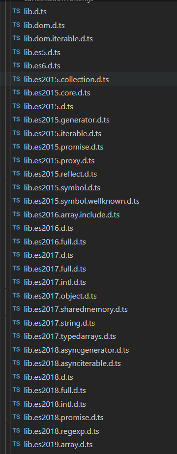

#### 安装typescript编译器

~~~js
// 全局安装
npm install -g typescript | yarn add typescript -g

// 项目安装
npm install typescript
~~~

查看ts命令行命令：

`tsc -h`

 

#### 编译代码

`tsc index.ts`

`typescript提供了静态的代码分析，它可以分析代码结构和提供的类型注解`

> 实例

ts代码：
~~~ts
class Student {
  fullName: string;
  constructor(public firstName, public middleInitial, public lastName) {
      this.fullName = firstName + " " + middleInitial + " " + lastName;
  }
}

interface Person {
  firstName: string;
  lastName: string;
}

function greeter(person : Person) {
  return "Hello, " + person.firstName + " " + person.lastName;
}

let student = new Student("Jane", "M.", "User");

greeter(student);
~~~

`tsc`编译后的js代码：
~~~js
// class编译成了构造函数，方法定义在原型上。
// private, protected, public直接修改构造函数的参数，相对于为实例属性字段。
var Student = /** @class */ (function () {
    function Student(firstName, middleInitial, lastName) {
        this.firstName = firstName;
        this.middleInitial = middleInitial;
        this.lastName = lastName;
        this.fullName = firstName + " " + middleInitial + " " + lastName;
    }
    Student.prototype.getFullName = function () {
        return this.fullName;
    };
    return Student;
}());
function greeter(person) {
    return "Hello, " + person.firstName + " " + person.lastName;
}
var student = new Student("Jane", "M.", "User");
greeter(student);
~~~

 

#### Gulp

~~~js
proj/
   ├─ src/
   └─ dist/
~~~

安装依赖：

~~~js
// 1、全局安装typescript和gulp
yarn add -g typescript gulp-cli

// 2、本地安装 gulp-typescript: typescript的gulp插件
yarn add typesript gulp gulp-typescript --dev
~~~

`src`下添加`main.ts`:

~~~ts
function hello(compiler: string) {
    console.log(`Hello from ${compiler}`);
}
hello("TypeScript");
~~~

新增`tsconfig.json`:

~~~json
{
    "files": [
        "src/main.ts"
    ],
    "compilerOptions": {
        "noImplicitAny": true,
        "target": "es5"
    }
}
~~~
`gulp配置文件gulpfile.js`：

~~~js
const gulp = require('gulp');
const ts = require('typescript-gulp');
const tsPro = ts.createProject('tsconfig.json');

gulp.task('default', () => {
  return tsProject.src()
        .pipe(tsProject())
        .js.pipe(gulp.dest("dist"));
});
~~~

运行： `gulp`

 

#### typescript的结构

可以看到目录下包括了基本的声明文件比如:`lib.d.ts`、`lib.dom.d.ts`等

还有针对每个`js`版本的声明文件，因为每个`js`版本引入的新特性都需要添加声明文件来维护，比如:`lib.es2015.generator.d.ts`、`lib.es2015.iterable.d.ts`、`lib.es2015.proxy.d.ts`、`lib.es2015.promise.d.ts`等。

~~~json
{
  "compilerOptions": {
    "outDir": "dist",
    "target": "ES5",
    "module":"CommonJS",
    "removeComments": true,
    "lib": [
      "DOM",
      "ES2015",
    ],
    "noImplicitThis": false
   }
}
~~~

`typescript`在编译时根据`target`默认引入不同的声明文件，除了默认引入的声明文件，也可以通过`tsconfig.json`的`lib`引入其他声明文件。

* 当设置`target: es2015`时，可以看到`lib.es2015.d.ts`如下：

~~~ts
/// <reference no-default-lib="true"/>

/// <reference lib="es5" />
/// <reference lib="es2015.core" />
/// <reference lib="es2015.collection" />
/// <reference lib="es2015.iterable" />
/// <reference lib="es2015.generator" />
/// <reference lib="es2015.promise" />
/// <reference lib="es2015.proxy" />
/// <reference lib="es2015.reflect" />
/// <reference lib="es2015.symbol" />
/// <reference lib="es2015.symbol.wellknown" />
~~~

针对于--target ES5：DOM，ES5，ScriptHost

针对于--target ES6：DOM，ES6，DOM.Iterable，ScriptHost