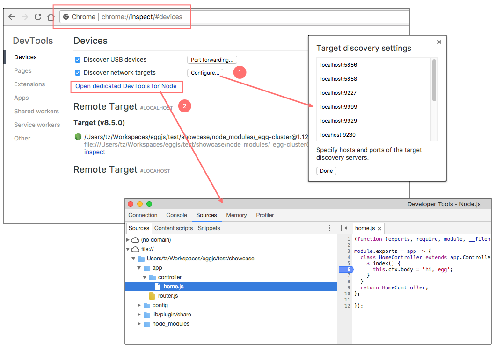
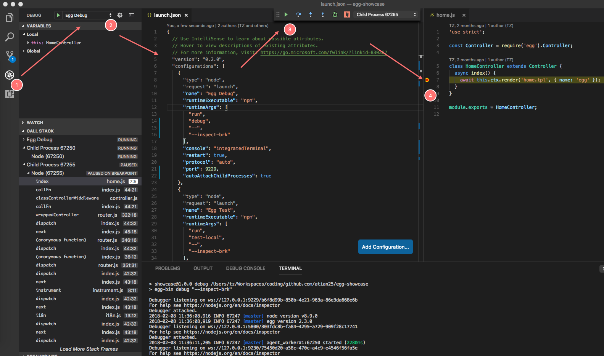

为了提升研发体验，我们提供了便捷的方式在`本地进行开发`、`调试`、`单元测试`等。

在这里我们需要使用到 [egg-bin](https://github.com/eggjs/egg-bin) 模块（只在本地开发和单元测试使用，如果线上请参考 应用部署）。

首先，我们需要把 `egg-bin` 模块作为 `devDependencies` 引入：

~~~js
$ npm i egg-bin --save-dev
~~~

 

### 启动应用

#### 添加命令

添加 `npm scripts` 到 `package.json`：

~~~json
{
  "scripts": {
    "dev": "egg-bin dev"
  }
}
~~~

使用`npm run dev`启动命令

#### 环境配置

本地启动的应用是以 `env: local` 启动的，读取的配置也是 `config.default.js` 和 `config.local.js` 合并的结果(`env:prod时，读取config.default.js和config.prod.js合并`)。

#### 指定端口

本地启动应用默认监听 `7001` 端口，可通过`--port`指定其他端口，例如：

~~~json
{
  "scripts": {
    "dev": "egg-bin dev --port 7001"
  }
}
~~~

 

### 单元测试

#### 添加命令

添加 `npm scripts` 到 `package.json`：

~~~json
{
  "scripts": {
    "test": "egg-bin test"
  }
}
~~~

#### 环境配置

`测试用例`执行时，应用是以 `env: unittest` 启动的，读取的配置也是 `config.default.js` 和 `config.unittest.js` 合并的结果。

#### 运行特定用例文件

运行 `npm test` 时会自动执行 `test` 目录下的以 `.test.js` 结尾的文件（默认 `glob` 匹配规则 `test/**/*.test.js` ）。

我们在编写用例时往往想单独执行正在编写的用例，可以通过以下方式指定特定用例文件：

~~~js
// 支持glob规则
$ TESTS=test/x.test.js npm test

$ TESTS=test/**/*.test.js npm test
~~~

#### 指定reporter

Mocha 支持多种形式的 reporter，默认使用 `spec` reporter。

可以手动设置 `TEST_REPORTER` 环境变量来指定 `reporter`，例如使用 `dot`：

~~~js
$ TEST_REPORTER=dot npm test
~~~

#### 指定用例超时时间

默认执行超时时间为 `30` 秒。我们也可以手动指定超时时间（单位毫秒），例如设置为 5 秒：

~~~js
$ TEST_TIMEOUT=5000 npm test
~~~

#### 通过 argv 方式传参

`egg-bin test` 除了环境变量方式，也支持直接传参，支持 mocha 的所有参数，参见：[mocha usage](https://mochajs.org/#usage)。

~~~js
$ # npm 传递参数需额外加一个 `--`，参见 https://docs.npmjs.com/cli/run-script
$ npm test -- --help
$
$ # 等同于 `TESTS=test/**/test.js npm test`，受限于 bash，最好加上双引号
$ npm test "test/**/test.js"
$
$ # 等同于 `TEST_REPORTER=dot npm test`
$ npm test -- --reporter=dot
$
$ # 支持 mocha 的参数，如 grep / require 等
$ npm test -- -t 30000 --grep="should GET"
~~~

 

### 调试

#### 使用 logger 模块

框架内置了`日志` 功能，使用 `logger.debug()` 输出调试信息，推荐在应用代码中使用它。

~~~js
// controller
this.logger.debug('current user: %j', this.user);

// service
this.ctx.logger.debug('debug info from service');

// app/init.js
app.logger.debug('app init');
~~~

通过 `config.logger.level` 来配置打印到文件的日志级别，通过 `config.logger.consoleLevel` 配置打印到终端的日志级别。

#### 使用 debug 模块

`debug` 模块是 Node.js 社区广泛使用的 `debug 工具`，很多模块都使用它模块打印调试信息，Egg 社区也广泛采用这一机制打印 debug 信息，`推荐在框架和插件开发中使用它`。

我们可以通过` DEBUG 环境变量`选择开启指定的调试代码，方便观测执行过程。

开启所有模块的日志：

~~~js
$ DEBUG=* npm run dev
~~~

开启指定模块的日志：

~~~js
$ DEBUG=egg* npm run dev
~~~

#### 使用 egg-bin 调试

添加 `npm scripts` 到 `package.json`：

~~~json
{
  "scripts": {
    "debug": "egg-bin debug"
  }
}
~~~

这样我们就可以通过 `npm run debug` 命令来断点调试应用。

同时也支持`自定义调试参数`：

~~~js
$ egg-bin debug --inpsect=9229
~~~

执行 `debug` 命令时，应用也是以 `env: local` 启动的，读取的配置是 `config.default.js` 和 `config.local.js` 合并的结果。

#### 使用 DevTools 进行调试

执行 `npm run debug` 启动：

然后选择以下一种方式即可：

* 直接访问控制台最后输出的 DevTools 地址，该地址是代理后的 worker，无需担心重启问题。

* 访问 `chrome://inspect`，配置对应的端口，然后点击 `Open dedicated DevTools for Node` 即可打开调试控制台。

#### 使用 VSCode 进行调试

方式一：开启 VSCode 配置 `Debug: Toggle Auto Attach`，然后在 Terminal 执行 n`pm run debug` 即可。

方式二：配置 VSCode 的 `.vscode/launch.json`，然后 F5 一键启动即可。（注意，需要关闭方式一中的配置）

~~~json
// .vscode/launch.json
{
  "version": "0.2.0",
  "configurations": [
    {
      "name": "Launch Egg",
      "type": "node",
      "request": "launch",
      "cwd": "${workspaceRoot}",
      "runtimeExecutable": "npm",
      "windows": { "runtimeExecutable": "npm.cmd" },
      "runtimeArgs": [ "run", "debug" ],
      "console": "integratedTerminal",
      "protocol": "auto",
      "restart": true,
      "port": 9229,
      "autoAttachChildProcesses": true
    }
  ]
}
~~~

我们也提供了一个 [vscode-eggjs](https://github.com/eggjs/vscode-eggjs) 扩展来自动生成配置。

