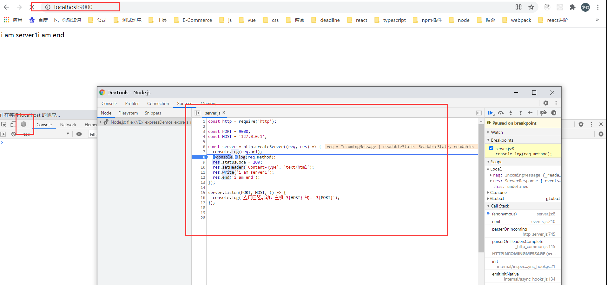
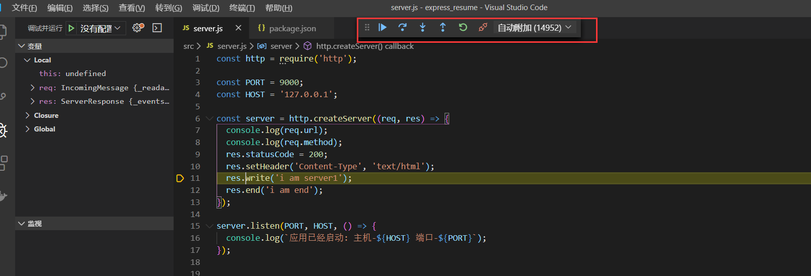
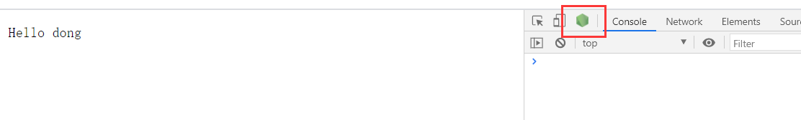
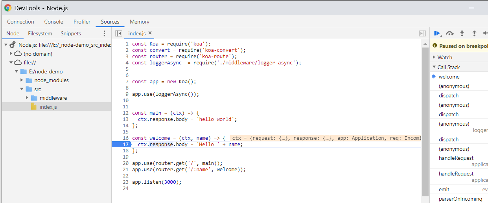
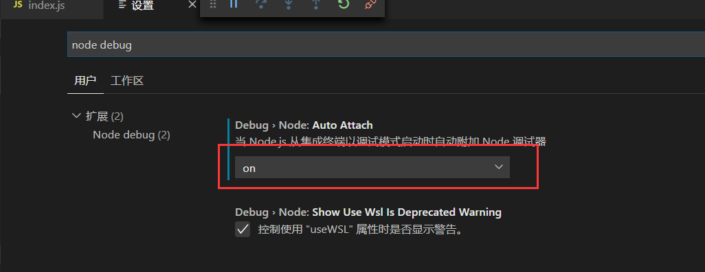
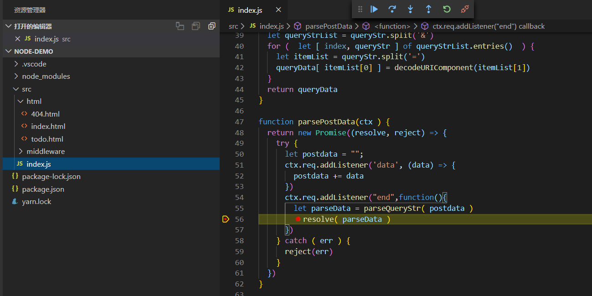

`nodemon`是一个工具，监听node应用中文件或者目录的变动，然后重启应用
使用nodemon, 只需在命令行中将nodemon 替代node( scripts中：
`"start": "nodemon ./src/server.js"  /  yarn start` )

~~~js
全局安装：npm install -g nodemon(安装后可以在命令行使用)

项目安装：npm install nodemon --save-dev （可以在package.json中添加script）
~~~

 

#### nodemon启动调试模式

~~~js
// npm scripts
"start": "nodemon --inspect ./src/server.js"
~~~

`在浏览器中进行断点调试`

`在vscode中进行调试`

 
 
 
 

#### node调试

`1、启动调试工具`

~~~js
node --inspect app.js
~~~

`--inspect` 参数是启动调试模式必须的

启动调试模式后，chome浏览器调试模式出现`node logo`标志，可以点击后调试

 

 
 

`2、vscode调试`

1、auto attach 设置为on

 
 

2、调试模式启动代码

~~~js
node --inspect index.js
~~~

3、接下来就可以在vscode中打断点进行调试了

