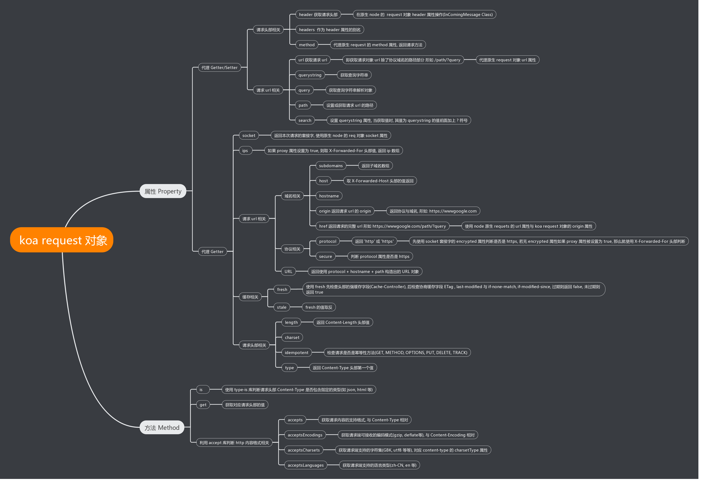

### 结构

### Request对象

~~~js
module.exports = {

  // 请求头
  get header() {
    return this.req.headers;
  },

  set header(val) {
    this.req.headers = val;
  },

  get headers() {
    return this.req.headers;
  },

  set headers(val) {
    this.req.headers = val;
  },

  // 请求url
  get url() {
    return this.req.url;
  },

  set url(val) {
    this.req.url = val;
  },

  // 请求origin = protocol + host
  get origin() {
    return `${this.protocol}://${this.host}`;
  },

  // 完整的url
  get href() {
    // support: `GET http://example.com/foo`
    if (/^https?:\/\//i.test(this.originalUrl)) return this.originalUrl;
    return this.origin + this.originalUrl;
  },

  // 请求方法
  get method() {
    return this.req.method;
  },

  set method(val) {
    this.req.method = val;
  },

  // 路径
  get path() {
    return parse(this.req).pathname;
  },

  set path(path) {
    const url = parse(this.req);
    if (url.pathname === path) return;

    url.pathname = path;
    url.path = null;

    this.url = stringify(url);
  },

  // 查询参数
  get query() {
    const str = this.querystring;
    const c = this._querycache = this._querycache || {};
    return c[str] || (c[str] = qs.parse(str));
  },

  set query(obj) {
    this.querystring = qs.stringify(obj);
  },

  get querystring() {
    if (!this.req) return '';
    return parse(this.req).query || '';
  },

  set querystring(str) {
    const url = parse(this.req);
    if (url.search === `?${str}`) return;

    url.search = str;
    url.path = null;

    this.url = stringify(url);
  },

  // search部分
  get search() {
    if (!this.querystring) return '';
    return `?${this.querystring}`;
  },

  set search(str) {
    this.querystring = str;
  },
  
  // 如果时代理获取X-Forwarded-Host头部
  // 如果不是代理获取Host头部
  get host() {
    const proxy = this.app.proxy;
    let host = proxy && this.get('X-Forwarded-Host');
    if (!host) {
      if (this.req.httpVersionMajor >= 2) host = this.get(':authority');
      if (!host) host = this.get('Host');
    }
    if (!host) return '';
    return host.split(/\s*,\s*/, 1)[0];
  },

  get hostname() {
    const host = this.host;
    if (!host) return '';
    if ('[' === host[0]) return this.URL.hostname || ''; // IPv6
    return host.split(':', 1)[0];
  },

  get URL() {
    /* istanbul ignore else */
    if (!this.memoizedURL) {
      const originalUrl = this.originalUrl || ''; // avoid undefined in template string
      try {
        this.memoizedURL = new URL(`${this.origin}${originalUrl}`);
      } catch (err) {
        this.memoizedURL = Object.create(null);
      }
    }
    return this.memoizedURL;
  },

  /**
   * Check if the request is fresh, aka
   * Last-Modified and/or the ETag
   * still match.
   *
   * @return {Boolean}
   * @api public
   */

  get fresh() {
    const method = this.method;
    const s = this.ctx.status;

    // GET or HEAD for weak freshness validation only
    if ('GET' !== method && 'HEAD' !== method) return false;

    // 2xx or 304 as per rfc2616 14.26
    if ((s >= 200 && s < 300) || 304 === s) {
      return fresh(this.header, this.response.header);
    }

    return false;
  },

  /**
   * Check if the request is stale, aka
   * "Last-Modified" and / or the "ETag" for the
   * resource has changed.
   *
   * @return {Boolean}
   * @api public
   */

  get stale() {
    return !this.fresh;
  },

  /**
   * Check if the request is idempotent.
   *
   * @return {Boolean}
   * @api public
   */

  get idempotent() {
    const methods = ['GET', 'HEAD', 'PUT', 'DELETE', 'OPTIONS', 'TRACE'];
    return !!~methods.indexOf(this.method);
  },

  /**
   * Return the request socket.
   *
   * @return {Connection}
   * @api public
   */

  get socket() {
    return this.req.socket;
  },

  /**
   * Get the charset when present or undefined.
   *
   * @return {String}
   * @api public
   */

  get charset() {
    try {
      const { parameters } = contentType.parse(this.req);
      return parameters.charset || '';
    } catch (e) {
      return '';
    }
  },

  /**
   * Return parsed Content-Length when present.
   *
   * @return {Number}
   * @api public
   */

  get length() {
    const len = this.get('Content-Length');
    if (len === '') return;
    return ~~len;
  },

  /**
   * Return the protocol string "http" or "https"
   * when requested with TLS. When the proxy setting
   * is enabled the "X-Forwarded-Proto" header
   * field will be trusted. If you're running behind
   * a reverse proxy that supplies https for you this
   * may be enabled.
   *
   * @return {String}
   * @api public
   */

  get protocol() {
    if (this.socket.encrypted) return 'https';
    if (!this.app.proxy) return 'http';
    const proto = this.get('X-Forwarded-Proto');
    return proto ? proto.split(/\s*,\s*/, 1)[0] : 'http';
  },

  /**
   * Shorthand for:
   *
   *    this.protocol == 'https'
   *
   * @return {Boolean}
   * @api public
   */

  get secure() {
    return 'https' === this.protocol;
  },

  /**
   * When `app.proxy` is `true`, parse
   * the "X-Forwarded-For" ip address list.
   *
   * For example if the value was "client, proxy1, proxy2"
   * you would receive the array `["client", "proxy1", "proxy2"]`
   * where "proxy2" is the furthest down-stream.
   *
   * @return {Array}
   * @api public
   */

  get ips() {
    const proxy = this.app.proxy;
    const val = this.get(this.app.proxyIpHeader);
    let ips = proxy && val
      ? val.split(/\s*,\s*/)
      : [];
    if (this.app.maxIpsCount > 0) {
      ips = ips.slice(-this.app.maxIpsCount);
    }
    return ips;
  },

  /**
   * Return request's remote address
   * When `app.proxy` is `true`, parse
   * the "X-Forwarded-For" ip address list and return the first one
   *
   * @return {String}
   * @api public
   */

  get ip() {
    if (!this[IP]) {
      this[IP] = this.ips[0] || this.socket.remoteAddress || '';
    }
    return this[IP];
  },

  set ip(_ip) {
    this[IP] = _ip;
  },

  /**
   * Return subdomains as an array.
   *
   * Subdomains are the dot-separated parts of the host before the main domain
   * of the app. By default, the domain of the app is assumed to be the last two
   * parts of the host. This can be changed by setting `app.subdomainOffset`.
   *
   * For example, if the domain is "tobi.ferrets.example.com":
   * If `app.subdomainOffset` is not set, this.subdomains is
   * `["ferrets", "tobi"]`.
   * If `app.subdomainOffset` is 3, this.subdomains is `["tobi"]`.
   *
   * @return {Array}
   * @api public
   */

  get subdomains() {
    const offset = this.app.subdomainOffset;
    const hostname = this.hostname;
    if (net.isIP(hostname)) return [];
    return hostname
      .split('.')
      .reverse()
      .slice(offset);
  },

  /**
   * Get accept object.
   * Lazily memoized.
   *
   * @return {Object}
   * @api private
   */

  get accept() {
    return this._accept || (this._accept = accepts(this.req));
  },

  /**
   * Set accept object.
   *
   * @param {Object}
   * @api private
   */

  set accept(obj) {
    this._accept = obj;
  },

  /**
   * Check if the given `type(s)` is acceptable, returning
   * the best match when true, otherwise `false`, in which
   * case you should respond with 406 "Not Acceptable".
   *
   * The `type` value may be a single mime type string
   * such as "application/json", the extension name
   * such as "json" or an array `["json", "html", "text/plain"]`. When a list
   * or array is given the _best_ match, if any is returned.
   *
   * Examples:
   *
   *     // Accept: text/html
   *     this.accepts('html');
   *     // => "html"
   *
   *     // Accept: text/*, application/json
   *     this.accepts('html');
   *     // => "html"
   *     this.accepts('text/html');
   *     // => "text/html"
   *     this.accepts('json', 'text');
   *     // => "json"
   *     this.accepts('application/json');
   *     // => "application/json"
   *
   *     // Accept: text/*, application/json
   *     this.accepts('image/png');
   *     this.accepts('png');
   *     // => false
   *
   *     // Accept: text/*;q=.5, application/json
   *     this.accepts(['html', 'json']);
   *     this.accepts('html', 'json');
   *     // => "json"
   *
   * @param {String|Array} type(s)...
   * @return {String|Array|false}
   * @api public
   */

  accepts(...args) {
    return this.accept.types(...args);
  },

  /**
   * Return accepted encodings or best fit based on `encodings`.
   *
   * Given `Accept-Encoding: gzip, deflate`
   * an array sorted by quality is returned:
   *
   *     ['gzip', 'deflate']
   *
   * @param {String|Array} encoding(s)...
   * @return {String|Array}
   * @api public
   */

  acceptsEncodings(...args) {
    return this.accept.encodings(...args);
  },

  /**
   * Return accepted charsets or best fit based on `charsets`.
   *
   * Given `Accept-Charset: utf-8, iso-8859-1;q=0.2, utf-7;q=0.5`
   * an array sorted by quality is returned:
   *
   *     ['utf-8', 'utf-7', 'iso-8859-1']
   *
   * @param {String|Array} charset(s)...
   * @return {String|Array}
   * @api public
   */

  acceptsCharsets(...args) {
    return this.accept.charsets(...args);
  },

  /**
   * Return accepted languages or best fit based on `langs`.
   *
   * Given `Accept-Language: en;q=0.8, es, pt`
   * an array sorted by quality is returned:
   *
   *     ['es', 'pt', 'en']
   *
   * @param {String|Array} lang(s)...
   * @return {Array|String}
   * @api public
   */

  acceptsLanguages(...args) {
    return this.accept.languages(...args);
  },

  /**
   * Check if the incoming request contains the "Content-Type"
   * header field and if it contains any of the given mime `type`s.
   * If there is no request body, `null` is returned.
   * If there is no content type, `false` is returned.
   * Otherwise, it returns the first `type` that matches.
   *
   * Examples:
   *
   *     // With Content-Type: text/html; charset=utf-8
   *     this.is('html'); // => 'html'
   *     this.is('text/html'); // => 'text/html'
   *     this.is('text/*', 'application/json'); // => 'text/html'
   *
   *     // When Content-Type is application/json
   *     this.is('json', 'urlencoded'); // => 'json'
   *     this.is('application/json'); // => 'application/json'
   *     this.is('html', 'application/*'); // => 'application/json'
   *
   *     this.is('html'); // => false
   *
   * @param {String|String[]} [type]
   * @param {String[]} [types]
   * @return {String|false|null}
   * @api public
   */

  is(type, ...types) {
    return typeis(this.req, type, ...types);
  },

  /**
   * Return the request mime type void of
   * parameters such as "charset".
   *
   * @return {String}
   * @api public
   */

  get type() {
    const type = this.get('Content-Type');
    if (!type) return '';
    return type.split(';')[0];
  },

  /**
   * Return request header.
   *
   * The `Referrer` header field is special-cased,
   * both `Referrer` and `Referer` are interchangeable.
   *
   * Examples:
   *
   *     this.get('Content-Type');
   *     // => "text/plain"
   *
   *     this.get('content-type');
   *     // => "text/plain"
   *
   *     this.get('Something');
   *     // => ''
   *
   * @param {String} field
   * @return {String}
   * @api public
   */

  get(field) {
    const req = this.req;
    switch (field = field.toLowerCase()) {
      case 'referer':
      case 'referrer':
        return req.headers.referrer || req.headers.referer || '';
      default:
        return req.headers[field] || '';
    }
  },
};
~~~

 

### Koa如何获取客户端ip地址

[参考文章](https://www.cnblogs.com/kevingrace/p/8269955.html)

`proxy_set_header 就是可设置请求头-并将头信息传递到服务器端， 即允许重新定义或添加字段传递给代理服务器的请求头。该值可以包含文本、变量和它们的组合`

nginx配置：

~~~js
server {
  listen 8062;
  server_name localhost;
  location / {
    proxy_pass http://127.0.0.1:9090;
    proxy_set_header X-Real-IP $remote_addr;
    proxy_set_header X-Real-PORT $remote_port;
    proxy_set_header X-Forwarded-For $remote_addr;
  }
}
~~~

~~~js
// request.js

  // 当proxy为true时, 通过获取代理服务器设置的请求头中的`X-Forwarded-For`或`X-Real-IP`来获取客户端ip地址，
  // 因此可以将proxyIpHeader设置为`X-Forwarded-For`
  // maxIpsCount 获取的最大ip数量
  get ips() {
    const proxy = this.app.proxy;
    const val = this.get(this.app.proxyIpHeader);
    // ip组逗号分割 "client, proxy1, proxy2" -> `["client", "proxy1", "proxy2"]`解析后，ips[0]即可获取客户端ip
    let ips = proxy && val
      ? val.split(/\s*,\s*/)
      : [];
    if (this.app.maxIpsCount > 0) {
      ips = ips.slice(-this.app.maxIpsCount);
    }
    return ips;
  },

  // 获取客户端ip地址，如果设置proxy: true，则返回解析后的第一个
  // 如果没有做服务器代理，则可以通过req.socket.remoteAddress获取客户端ip
  get ip() {
    if (!this[IP]) {
      this[IP] = this.ips[0] || this.socket.remoteAddress || '';
    }
    return this[IP];
  },

  set ip(_ip) {
    this[IP] = _ip;
  },
~~~

~~~js
// 域名：tobi.ferrets.example.com
// subdomainOffset 设置子域名的偏移位置
// 当为2时，返回 ["ferrets", "tobi"]
// 当为3时，返回 ["tobi"]
get subdomains() {
    const offset = this.app.subdomainOffset;
    const hostname = this.hostname;
    if (net.isIP(hostname)) return [];
    return hostname
      .split('.')
      .reverse()
      .slice(offset);
  },
~~~