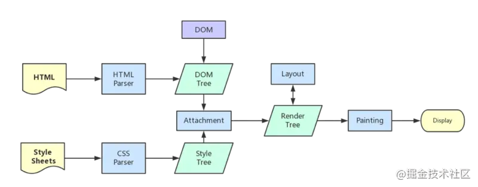

> translate 是 transform 属性的⼀个值。改变transform或opacity不会触发浏览器重新布局（reflow）或重绘（repaint），只会触发复合（compositions）。⽽改变绝对定位会触发重新布局，进⽽触发重绘和复合。transform使浏览器为元素创建⼀个 GPU 图层，但改变绝对定位会使⽤到 CPU。 因此translate()更⾼效，可以缩短平滑动画的绘制时间。 ⽽translate改变位置时，元素依然会占据其原始空间，绝对定位就不会发⽣这种情况。

 

**重排**(reflow)和**重绘**(repaint)

 

#### 页面生成过程

1、HTML 被 HTML 解析器解析成 DOM 树

2、CSS 被 CSS 解析器解析成 CSSOM 树

3、结合 DOM 树和 CSSOM 树，生成一棵渲染树(Render Tree)，这一过程称为 Attachment

4、生成布局(flow)，浏览器在屏幕上“画”出渲染树中的所有节点

5、将布局绘制(paint)在屏幕上，显示出整个页面

第四步和第五步是最耗时的部分，这两步合起来，就是我们通常所说的**渲染**。

  

#### 渲染

在页面的生命周期中，网页生成的时候，至少会渲染一次。在用户访问的过程中，还会不断触发`重排`(reflow)和`重绘`(repaint)，不管页面发生了重绘还是重排，都会影响性能，最可怕的是`重排`，会使我们付出高额的性能代价，所以我们应尽量避免。

 

#### 重排、重绘

* 重排：重新生成布局，重新排列元素。

* 重绘：某些元素的外观被改变，例如：元素的填充颜色

单单改变元素的外观，肯定不会引起网页重新生成布局，但当浏览器完成重排之后，将会重新绘制受到此次重排影响的部分。比如改变元素高度，这个元素乃至周边dom都需要重新绘制。

**重绘不一定导致重排，但重排一定会导致重绘**

 

#### 重排(reflow)

定义：当DOM的变化影响了元素的几何信息(元素的的`位置`和`尺寸大小`)，浏览器需要重新计算元素的几何属性，将其安放在界面中的正确位置，这个过程叫做`重排`。

`重排`也叫`回流`，简单的说就是`重新生成布局`，`重新排列元素`。

下面情况会发生重排：

* 页面初始渲染，这是开销最大的一次重排

* 添加/删除可见的DOM元素

* 改变元素位置

* 改变元素尺寸，比如边距、填充、边框、宽度和高度等

* 改变元素内容，比如文字数量，图片大小等

* 改变元素字体大小

* 改变浏览器窗口尺寸，比如resize事件发生时

* 激活CSS伪类（例如：:hover）

* 设置 style 属性的值，因为通过设置style属性改变结点样式的话，每一次设置都会触发一次reflow

* 查询某些属性或调用某些计算方法：offsetWidth、offsetHeight等，除此之外，当我们调用 getComputedStyle方法，或者IE里的 currentStyle 时，也会触发重排，原理是一样的，都为求一个“即时性”和“准确性”。

`重排影响的范围：`

由于浏览器渲染界面是基于流式布局模型的，所以触发重排时会对周围DOM重新排列，影响的范围有两种：

* 全局范围：从根节点html开始对整个渲染树进行重新布局。

* 局部范围：对渲染树的某部分或某一个渲染对象进行重新布局

 

#### 重绘

当一个元素的外观发生改变，但没有改变布局,重新把元素外观绘制出来的过程，叫做**重绘**。

 

#### 重排优化建议

重排的代价是高昂的，会破坏用户体验，并且让UI展示非常迟缓。通过减少重排的负面影响来提高用户体验的最简单方式就是尽可能的减少重排次数，重排范围。下面是一些行之有效的建议，大家可以用来参考。

`减少重排范围`:

我们应该尽量以局部布局的形式组织html结构，尽可能小的影响重排的范围。

* 尽可能在低层级的DOM节点上，而不是像上述全局范围的示例代码一样，如果你要改变p的样式，class就不要加在div上，通过父元素去影响子元素不好。

* 不要使用 table 布局，可能很小的一个小改动会造成整个 table 的重新布局。那么在不得已使用table的场合，可以设置table-layout:auto;或者是table-layout:fixed这样可以让table一行一行的渲染，这种做法也是为了限制reflow的影响范围。

`减少重排次数`:

1.样式集中改变

~~~css
// bad
var left = 10;
var top = 10;
el.style.left = left + "px";
el.style.top = top + "px";

// 当top和left的值是动态计算而成时...
// better 
el.style.cssText += "; left: " + left + "px; top: " + top + "px;";

// better
el.className += " className";
~~~

2.优化动画

* 可以把动画效果应用到 position属性为 absolute 或 fixed 的元素上，这样对其他元素影响较小。

* 启用GPU加速 GPU 硬件加速是指应用 GPU 的图形性能对浏览器中的一些图形操作交给 GPU 来完成，因为 GPU 是专门为处理图形而设计，所以它在速度和能耗上更有效率。

