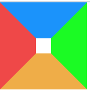
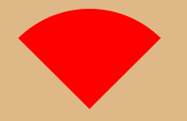

#### 三角形

当div有**width**和**height**时

~~~css
.box {
  width: 30px;
  height: 30px;
  border: 50px solid;
  border-color: red blue yellow green;
}
~~~

当width和height为0时，变成四角形

当需要显示不同的三角形时，可以设置其他三个`border-color`为`transparent`透明

 

#### 扇形

将上面的三角加一个圆角即可(border-radius: 50%;)

~~~css
border: 100px solid transparent;
width: 0px;
height: 0px;
border-radius: 50%;
border-top-color: red;
~~~