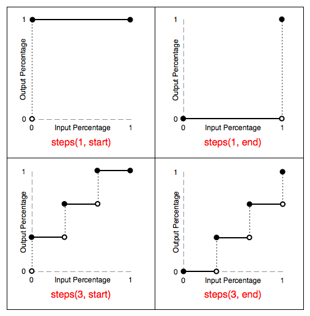
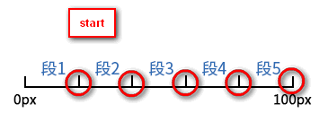
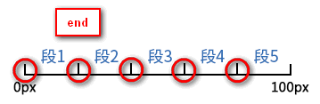

#### 动画频率

多数显示器默认频率是60Hz，即1秒刷新60次，所以理论上最小间隔为1/60＊1000ms ＝ 16.7ms。

#### 动画

定义动画：

~~~css
@keyframe animateName {}
~~~

* `animation`: ` name duration timing-function delay iteration-count direction fill-mode`

* `animation-name`: 动画名称

* `animation-durtion`: 动画完成一个周期的时间

* `animation-time-function`: 动画速度曲线, 默认`ease(慢-快-慢)`

* `animation-delay`: 动画延迟

* `animation-iteration-count`: 动画播放的次数，默认1

* `animation-direction`: 动画在下一个周期是否逆向播放

* `animation-fill-mode`: 当动画不播放时（当动画完成或当动画有延迟并未播放时），要应用到元素的样式

* `animation-play-state`: 规定动画是否在运行或者暂停，`running/paused`

 

#### 调试动画

通过将`animation-play-state: paused`暂停动画，在使用`animation-delay`设置为负值即可调试每一刻的动画(负值表示从元素多少秒的状态开始动画)

~~~css
& > div {
    position: absolute;
    width: 40px;
    height: 40px;
    border-radius: 50%;
    background-color: red;
    left: 0px;
    top: 100px;
    animation: go 4s ease -1s infinite alternate;
    animation-play-state: paused;
    @keyframes go {
      0% {
        left: 0px;
        transform: scale(1, 1);
      }
      100% {
        left: 400px;
        transform: scale(1.5, 1.5);
      }
    }

  }
~~~

 

#### 其他属性

`1、animation-timing-function`

linear:  匀速

ease:  慢 -> 快 -> 慢

esse-in: 慢 -> 快

ease-out: 快 -> 慢 

ease-in-out: 慢 -> 快 -> 慢

cubic-bezier(x1,y1,x2,y2)  n(0~1) 贝塞尔曲线 生成速度曲线函数

`2、animation-delay`

**0s是该属性的默认值，代表动画在应用到元素上后立即开始执行**。否则，该属性的值代表动画样式应用到元素上后到开始执行前的时间长度；

**定义一个负值会让动画立即开始。但是动画会从它的动画序列中某位置开始。例如，如果设定值为-1s，动画会从它的动画序列的第1秒位置处立即开始。**

比如一个动画4s，设置元素动画延迟-3秒，则动画直接从3秒时元素的状态开始动画

`3、animation-iteration-count`

`n | infinite`

`4、animation-direction`

动画循环播放时，每次都是从**结束状态**跳回到**起始状态**，再开始播放。animation-direction属性，可以改变这种行为。

其中`alternate`可以使动画来回循环播放(`来回无限滚动的小球`)

`normal`:  正常播放

`reverse`:  动画反向播放

`alternate`:  动画在奇数次（1、3、5...）正向播放，在偶数次（2、4、6...）反向播放 

`alternate-reverse`: 动画在奇数次（1、3、5...）反向播放，在偶数次（2、4、6...）正向播放

`5、animation-fill-mode`

`none`: 

默认值，动画在动画执行前和之后不会应用任何样式到目标元素

`forwords`:  

forwards表示让动画停留在结束状态，动画结束标志为from，或者100%，如果没有设置结束状态则直接回到起始状态。

如下： 来回滚动4次后停在结束状态位置。
~~~css
animation: go 4s ease 0s 4 alternate forwards;
~~~

动画结束以后，会立即从结束状态跳回到起始状态。如果想让动画保持在结束状态，需要使用animation-fill-mode属性。

`backwords:`

让动画回到第一帧的状态。

`both: ` 

根据`animation-direction `轮流应用`forwards`和`backforwards`

 

#### steps函数 逐帧动画

animation-timing-function 分为两类：

`1、缓动函数`

ease, liner, ease-in, ease-out, ease-in-out, 贝塞尔曲线

`2、阶梯函数`

主要用户动画阶梯变化而不是缓慢变化

steps(<integer>[, [ start | end ] ]?)

steps(number_of_steps, direction)

第一个参数指定了函数中的间隔数量（必须是正整数）；

第二个参数可选，指定在每个间隔的起点或是终点发生阶跃变化，接受 start 和 end 两个值，默认为 end。

`start与end`的区别，更加直观的步骤如下：

