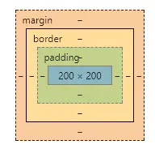

盒子模型如下：

`content + padding + border + margin`

盒子模型由`box-sizing`来控制

* `box-sizing: content-box`: `元素的width和height为内容的宽高`

* `box-sizing: border-box`: `width = content + padding + border + margin`

一般常用的，`width/hight`设置为内容宽高，因此如果有`padding`  `border` `margin`的需要设置`box-sizing:content-box`