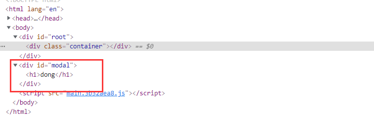
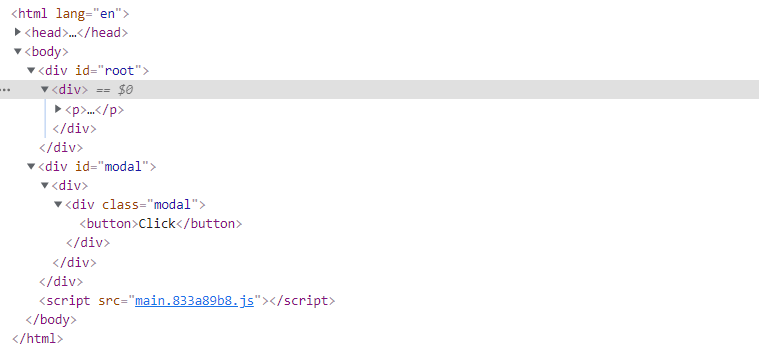

`Portal` 提供了一种将`子节点`渲染到存在于`父组件以外的 DOM 节点`的优秀的方案。

~~~js
ReactDOM.createPortal(child, container)
~~~

第一个参数（child）是任何可渲染的 React 子元素，例如一个元素，字符串或 fragment。第二个参数（container）是一个 DOM 元素。

 

#### 效果

~~~js
import React from 'react';
import * as ReactDOM from 'react-dom';

class App extends React.Component {
  constructor(props) {
    super(props); 
  }

  render() {
    return 

      {
        ReactDOM.createPortal(<h1>dong</h1>, document.getElementById('modal'))
      }
    
;
  }
}

export default App;
~~~

可以看到`<h1>dong</h1>`并没有渲染到`root -> container`dom下面，而是直接脱离了原来的渲染逻辑，渲染到了`modal`下面。

一个`portal`的典型用例是当父组件有 `overflow: hidden` 或 `z-index` 样式时，但你需要子组件能够在视觉上“跳出”其容器。例如，对话框、悬浮卡以及提示框：

 

#### 通过 Portal 进行事件冒泡

一个从 `portal` 内部触发的事件会一直冒泡至包含 React 树的祖先，即便这些元素并不是 DOM 树 中的祖先。

~~~js
<html>
  <body>
    

    

  </body>
</html>
~~~

在 `#app` 里的 `Parent` 组件能够捕获到未被捕获的从兄弟节点 `#modal` 冒泡上来的事件。

~~~js
import React from 'react';
import * as ReactDOM from 'react-dom';

const appRoot = document.getElementById('app');
const modalRoot = document.getElementById('modal');

class Modal extends React.Component {
  constructor(props) {
    super(props);
    this.el = document.createElement('div');
  }

  componentDidMount() {
    // 将div挂载到modal节点
    modalRoot.appendChild(this.el);
  }

  componentWillUnmount() {
    modalRoot.removeChild(this.el);
  }

  render() {
    return ReactDOM.createPortal(
      this.props.children,
      this.el
    );
  }
}

class Parent extends React.Component {
  constructor(props) {
    super(props);
    this.state = {clicks: 0};
    this.handleClick = this.handleClick.bind(this);
  }

  handleClick() {
    this.setState(state => ({
      clicks: state.clicks + 1
    }));
  }

  render() {
    return (
      

        
Number of clicks: {this.state.clicks}

        <Modal>
          <Child />
        </Modal>
      

    );
  }
}

function Child() {
  // 这个按钮的点击事件会冒泡到父元素
  // 因为这里没有定义 'onClick' 属性
  return (
    

      <button>Click</button>
    

  );
}

export default Parent;
~~~

`button`按钮是渲染到`modal`下面，`Parent`组件渲染到`root`下面，但是`button`的点击事件仍然可以冒泡到`Parent`并被捕获。

渲染的效果如下：

