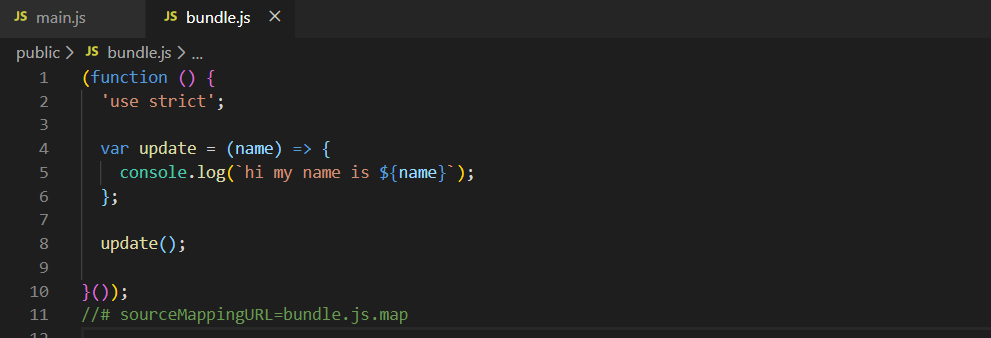
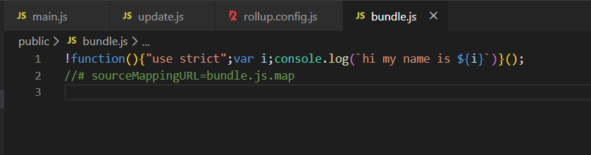
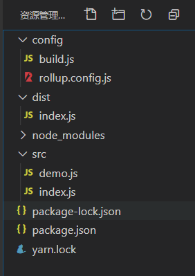

## 介绍

#### 概述

> Rollup是一个js模块打包器，可以将`小模块`代码编译成`大块复杂`代码，例如`library`或`应用程序`,Rollup对模块代码使用新的标准化格式，这些格式都包含在`js的ES6版本中`，而不是以前的特殊解决方案，如CommonJS和AMD，ES6模块可以使你自由，无缝地使用你最喜爱的library中那些最有用独立函数，而你的项目不必携带其他未使用的代码，ES6模块最终还是要由浏览器原生实现，但当前Rollup可以使你提前体验。

#### 快速入门指南
使用`npm install --global rollup`全局安装，也可以`npm install rollup --save-dev`本地安装

1、通过命令行使用

2、通过命令行和配置文件`rollup.config.js`使用

3、通过`Javascript API`来调用 

运行`rollup --help`查看可用选项和参数

> rollup-start-app : 应用程序

~~~js
import resolve from '@rollup/plugin-node-resolve';
import commonjs from '@rollup/plugin-commonjs';
import { terser } from 'rollup-plugin-terser';

//  `npm run build` -> `production` is true
//  `npm run dev` -> `production` is false
//  开发和生产环境变量可以通过cross-env来设置
const production = !process.env.ROLLUP_WATCH;

export default {
	input: 'src/main.js',  // 入口文件
	output: {
		file: 'public/bundle.js', // 输出文件
		format: 'iife',  // 输出为立即调用函数, 可以在非模块化项目中通过<script>标签引入
		sourcemap: true  // 生成sourcemap, 开发环境便于代码调试，生成环境要关掉
	},
	plugins: [
		resolve(), // 使用node的模块系统，解决node_modules中的模块依赖
		commonjs(), // 将非ES6模块的CommonJS模块转换错ES6模块，供Rollup处理
		production && terser()  // 生产环境下代码压缩
	]
};
~~~

1、代码打包成`iife`  
2、生产sourcemap文件  
3、打包后的代码，需要使用`babel和babel插件`转换为ES5

 

使用`rollup-plugin-terser`压缩后的代码：

 

 
 
 

> rollup-start-lib : 库

打包输出：兼容AMD、CommonJs、ES Module的`umd`格式 |  `CommonJS`格式 | `ES Module`格式

~~~js
import resolve from '@rollup/plugin-node-resolve';
import commonjs from '@rollup/plugin-commonjs';
import pkg from './package.json';

export default [
	// umd
	{
		input: 'src/main.js',
		output: {
			name: 'howLongUntilLunch', // 全局变量名称
			file: pkg.browser,
			format: 'umd'
		},
		plugins: [
			resolve(), // npm 依赖'ms'模块
			commonjs() // 因为'ms'模块是CommonJS模块，需要转换成ES6模块
		]
	},
	// 1、构建CommonJs和ES module
	// 2、output可以为数组，同时构建输出多个模块  
    // 3、将ms作为外部依赖，可以添加到Peer dependencies
	{
		input: 'src/main.js',
		external: ['ms'],
		output: [
			{ file: pkg.main, format: 'cjs' },
			{ file: pkg.module, format: 'es' }
		]
	}
];
~~~

package.json  

~~~json
{
  "name": "rollup-starter-lib",
  "version": "1.0.0",
  "main": "dist/how-long-till-lunch.cjs.js",
  "module": "dist/how-long-till-lunch.esm.js",
  "browser": "dist/how-long-till-lunch.umd.js",
  "dependencies": {
    "ms": "^2.0.0"
  },
  "devDependencies": {
    "@rollup/plugin-commonjs": "^11.0.1",
    "@rollup/plugin-node-resolve": "^7.0.0",
    "rollup": "^1.29.0"
  },
  "scripts": {
    "build": "rollup -c",
    "dev": "rollup -c -w",
    "test": "node test/test.js",
    "pretest": "npm run build"
  },
  "files": [
    "dist"
  ]
}
~~~

命令行写法：  

~~~
$ rollup main.js --file|-o bundle.js --format|-f iife

$ rollup main.js --file|-o bundle.js --format|-f cjs

$ rollup main.js --file|-o bundle.js --format|-f es|esm

$ rollup main.js --file|-o bundle.js --format|-f umd --name "myBundle"
~~~

*上面已经包括了常见的`iife`、`umd`、`cjs`、`es|esm`(`amd`不常用 )模式的打包实例*

 
 
 

#### Tree-shaking

除了使用ES6模块之外，Rollup还`静态分析`代码中的import,并将排除排除任何未实际使用的代码，这允许您架构于现有的工具和模块之上，而不会增加额外的依赖和使项目的大小膨胀。

因为Rollup只引入最基本最精简代码，所以可以生成轻量，快速以及低复杂度的`library`和`应用程序`，因此这种基于显示import 和 export 语句的方式，它远比[在编译后的代码中，简单地运行自动minifier检测未使用的变量]更有效。

#### 兼容性

导入CommonJs  

Rollup可以通过插件(`@rollup/plugin-commmonjs`)导入存在的CommonJS模块

发布ES6模块  

为了确保你的ES6模块可以直接与运行在CommonJS(weboack和node)中的工具使用，你可以使用Rollup编译成UMD或CommonJS格式，然后在`package.json`文件的`main`属性中指向当前编译的版本`cjs`,如果你的package.json也有`module`字段，指向(`es|esm`)编译的版本, `browser`指向`umd`编译输出的入口文件，像Rollup和webpack 这样的ES6感知工具将会直接导入ES6模块版本。

#### 常见问题

<h5>为什么ES模块比CommonJS模块更好?</h5>

ES模块是官方标准，也是js语音明确发展的方向，而CommonJS模块是一种node上使用的特殊的传统格式，在ES模块被提出前作为暂时的解决方案，ES模块允许进行tree-shaking优化，并提供诸如循环引用和动态绑定等高级功能。

<h5>什么是tree-shaking?</h5>

它是清除实际上并没有在给定项目中使用的代码过程，它是它更加高效。

<h5>如何在CommonJS模块中使用Rollup?</h5>

Rollup力图实现ES模块的规范，而不一定是Node.js, npm, require()和CommonJS的特性, 因此，加载CommonJS模块和使用Node模块位置解析逻辑都被实现为可选插件，默认情况下不在Rollup内核中，你只需要安装`@rollup/plugin-node-resolve`和`@rollup/plugin-commonjs`插件然后再`rollup.config.js`配置文件中启用他们，那就完成了所有配置。

<h5>Rollup是用来构建库还是应用程序?</h5>

Rollup已被许多主流的js库使用，也可以用于构建大多数应用程序，但是Rollup还不支持一些特定的高级功能，尤其是用在构建一些应用程序时，特别时`代码拆分`和`webpack动态导入(import -> promise)`, 如果你的项目中使用了这些功能，使用`webpack`更好。

#### 使用配置文件

创建一个rollup.config.js配置文件`-c 或 --config`指定配置文件 

~~~js
rollup --config rollup.config.dev.js

rollup --config rollup.config.prod.js
~~~

#### 使用插件  

通过相对路径，将一个入口文件和一个模块创建成了一个简单的bundle, 随着构建更加复杂的bundle, 通常需要更大的灵活性 -  `引入npm安装的模块`, `通过Babel编译代码`, `JSON文件的模块化处理`

为此我们可以通过`插件(plugins)`在打包的关键过程中更改Rollup的行为

使用`@rollup/plugin-json`插件，把json文件当做ES模块来处理，可以导入json文件

安装： `yarn add @rollup/plugin-json --dev`

修改`rollup.config.js`文件：
~~~
import json from 'rollup-plugin-json';

export default {
  input: 'src/main.js',
  output: {
    file: 'bundle.js',
    format: 'cjs'
  },
  plugins: [ json() ]
};
~~~

 
 
 

## 命令行  

一般在命令行中使用Rollup，你也可以提供一份配置文件来简化命令行操作，同时还能启用Rollup的高级特性。

#### 配置文件

配置文件是一个ES模块，对外暴露一个对象({}或[]), 这个对象包含了一些Rollup需要的一些选项，通常我们把这个配置文件叫做`rollup.config.js`,通常位于项目的根目录下。

配置项清单：  
~~~js
// rollup.config.js
export default {
  // 核心选项
  input,     // 必须
  external,
  plugins,

  // 额外选项
  onwarn,

  // danger zone
  acorn,
  context,
  moduleContext,
  legacy

  output: {  // 必须 (如果要输出多个，可以是一个数组)
    // 核心选项
    file,    // 必须
    format,  // 必须
    name,
    globals,

    // 额外选项
    paths,
    banner,
    footer,
    intro,
    outro,
    sourcemap,
    sourcemapFile,
    interop,

    // 高危选项
    exports,
    amd,
    indent
    strict
  },
};
~~~
你必须使用配置文件才能执行一下操作：

* 把一个项目打包，然后输出多个文件  

* 使用Rollup插件

如果想要使用Rollup配置文件，记得在命令行中加上 `--config`或 `-c`

#### 命令行的参数

配置文件中许多选项和命令行的参数是等价的，如果你使用这里的参数，那么将重写配置文件

~~~
-i, --input <filename>      要打包的文件（必须）
-o, --file <output>         输出的文件 (如果没有这个参数，则直接输出到控制台)
-f, --format <format>       输出的文件类型 (amd, cjs, esm, iife, umd)
-e, --external <ids>        将模块ID的逗号分隔列表排除
-g, --globals <pairs>       以`module ID:Global` 键值对的形式，用逗号分隔开 
                              任何定义在这里模块ID定义添加到外部依赖
-n, --name <name>           生成UMD模块的名字
-h, --help                  输出 help 信息
-m, --sourcemap             生成 sourcemap (`-m inline` for inline map)
--amd.id                    AMD模块的ID，默认是个匿名函数
--amd.define                使用Function来代替`define`
--no-strict                 在生成的包中省略`"use strict";`
--no-conflict               对于UMD模块来说，给全局变量生成一个无冲突的方法
--intro                     在打包好的文件的块的内部(wrapper内部)的最顶部插入一段内容
--outro                     在打包好的文件的块的内部(wrapper内部)的最底部插入一段内容
--banner                    在打包好的文件的块的外部(wrapper外部)的最顶部插入一段内容
--footer                    在打包好的文件的块的外部(wrapper外部)的最底部插入一段内容
--interop                   包含公共的模块（这个选项是默认添加的）
~~~

此外：

~~~
-w/--watch:  监听源文件是否有改动，如果有改动，重新打包

--silent: 不要将警告打印到控制台
~~~

 
 
 

## Javscipt API

`Rollup提供js接口那样可以通过NodeJs来使用`，你可以很少使用，而且很可能使用命令行接口，除非你想扩展Rollup本身，或用于一些难懂的任务，例如用代码把文件束生成处理。

下面的API在node中使用

#### rollup.rollup

 

`rollup.config.js:`
~~~js
const path = require('path');
const { babel } = require('@rollup/plugin-babel');

const resolveFile = (filePath) => {
  return path.join(__dirname, '..', filePath);
};

module.exports = {
  input: resolveFile('src/index.js'),

  output: {
    file: resolveFile('dist/index.js'),
    format: 'cjs',
  },

  plugins: [
    babel({
      "presets": ['@babel/preset-env']
    }),
  ]
};
~~~

`build.js:`
~~~js
const rollup = require('rollup');
const config = require('./rollup.config');

const inputOptions = config;
const outputOptions = config.output;

async function build () {
  const bundle = await rollup.rollup(inputOptions);

  console.log(Reflect.ownKeys(bundle));

  const { code, map } = await bundle.generate(outputOptions);

   await bundle.write(outputOptions);
};

build();
~~~

`node ./config/build.js` 打包代码

输入参数：  

~~~js
const inputOptions = {
  // 核心参数
  input, // 唯一必填参数
  external,
  plugins,

  // 高级参数
  onwarn,
  cache,

  // 危险参数
  acorn,
  context,
  moduleContext,
  legacy
};
~~~

输出参数：

~~~js
const outputOptions = {
  // 核心参数
  file,   // 若有bundle.write，必填
  format, // 必填
  name,
  globals,

  // 高级参数
  paths,
  banner,
  footer,
  intro,
  outro,
  sourcemap,
  sourcemapFile,
  interop,

  // 危险区域
  exports,
  amd,
  indent
  strict
};
~~~

#### rollup.watch

Rollup也提供了rollup.watch函数，当它检测到磁盘上单个模块已经改变，它会重新构建你的文件束，当你通过命令行运行Rollup，并带上`--watch`标记时，此函数会被内部使用

`build.js代码:`
~~~js
const rollup = require('rollup');
const config = require('./rollup.config');

const inputOptions = config;
const outputOptions = config.output;

const watchOptions = {
  ...inputOptions,
  output: [outputOptions]
};

const watcher = rollup.watch(watchOptions);

// event.code 如下：
// START:  监听器正在启动(重启)
// BUNDLE_START: 构建单个文件束
// BUNDLE_END: 完成文件束构建
// END: 完成所有文件束构建
// ERROR: 构建时遇到错误
// FATAL: 遇到无可修复的错误
watcher.on('event', (event) => {
  console.log(event);
});

watcher.close();
~~~

监听参数：
~~~js
const watchOptions = {
  ...inputOptions,
  output: [outputOptions],
  watch: {
    chokidar,
    include,
    exclude
  }
};
~~~

 
 
 

## Rollup 与其他工具集成  

#### npm packages

在某些时候，你的项目很可能依赖于从npm安装到你的node_modules文件夹中的软件包，于webpack和Browserify这样的捆绑包不同，Rollup不知道如何打破常规去处理这些依赖， 因此要添加一些配置。

`@rollup/plugin-node-resolve`

告诉Rollup如何查找外部模块(去node_modules找模块)

`@rollup/plugin-commonjs`  

这个插件将`CommonJS`转换成`ES2015`模块。

一些库导出成你可以正常导入的 ES6 模块 - the-answer 就是一个这样的模块。 但是目前， npm 中的大多数包都是以 CommonJS 模块的形式出现的。 在它们更改之前，我们需要将 CommonJS 模块转换为 ES2015 供 Rollup 处理。

** `@rollup/plugin-commonjs`应该用在其他插件转换你的模块之前，这是防止其他插件的改变破坏了CommonJS的检测。

#### Peer dependencies  

假如你在构建一个具有`对等依赖关系(peer dependency)`的库，例如React或Lodash，如果你如上设置外部引用(`externals`), 你的Rollup将把所有imports的模块打包在一起：

~~~js
import answer from 'the-answer';

import _ from 'lodash';
~~~

你可以微调那些导入是想要打包的，那些事外部的引用(externals), 对于上面的例子，认为lodash是外部引用，而不是the-answer,则配置文件为：

~~~js
import resolve from 'rollup-plugin-node-resolve';

export default {
  input: 'src/main.js',
  output: {
    file: 'bundle.js',
    format: 'cjs'
  },
  plugins: [resolve({
    // 将自定义选项传递给解析插件
    customResolveOptions: {
      moduleDirectory: 'node_modules'
    }
  })],
  // 指出应将哪些模块视为外部模块
  external: ['lodash']
};
~~~

这样，lodash现在将被视为外部的，不会与库打包在一起(`依赖该库的项目需要安装lodash`), `externals`接受一个模块名称的数组或一个接受模块名称的函数，如果被视为外部引用，则返回true

~~~js
export default {
  // ...
  external: id => /lodash/.test(id)
}
~~~

如果你使用`babel-plugin-lodash`来最优选择lodash模块，在这种情况下，babel将转换你的导入语句，如下：
~~~js
import _merge from 'lodash/merge';
~~~

`external`的数组形式不会处理通配符，所以这个导入只会以函数的形式被视为外部依赖/引用。

