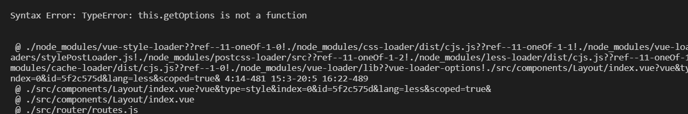

### 

1、vue项目中webpack别名提示

vscode安装path-alias插件，在settting.json中添加如下配置

```
"pathAlias.aliasMap": {
    "@": "${cwd}/src",
    "@c": "${cwd}/src/components",
    "@v": "${cwd}/src/views",
    "@assets": "${cwd}/src/assets"
 }
```


2、vue2中less-loader版本过高导致的报错 "less-loader": "^10.2.0",  版本降低"less-loader": "^5.0.0",



3、全局变量和mixin  

webpack loader：style-resources-loader  vue-cli-plugin-style-resources-loader

vue.config.js配置

```
  pluginOptions: {
    'style-resources-loader': {
      preProcessor: 'less',
      patterns: [
        `${__dirname}/src/assets/style/common.less`,
        `${__dirname}/src/assets/style/mixin.less`,
        `${__dirname}/src/assets/style/variables.less`, 
      ]
    }
  }
```

veriables.less内容如下：然后其他vue组件即可在style内引入了

```
@default-background-color: rgba(0,0,0,0.2);
```

4、less一键主题切换

css var

