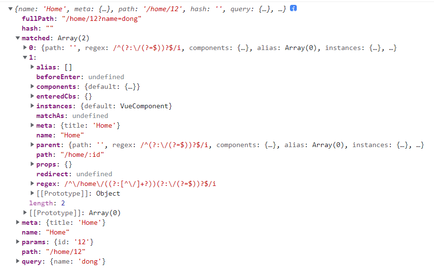

### this.$route



```
export default [
  {
    name: 'Layout',
    meta: {},
    path: '/',
    component: Layout,
    children: [
      {
        name: 'Home',
        meta: { 
          title: 'Home'
        },
        path: '/home/:id',
        component: Home,
      }
    ]
  }
];

fullPath: 全路径
hash:  页面hash
matched: 匹配到的路径，可以通过配置layout组件，公共的页面头部或底部
meta: 元数据信息
path: 当前路径path
params: 路径参数
query: 路径查询参数
```

