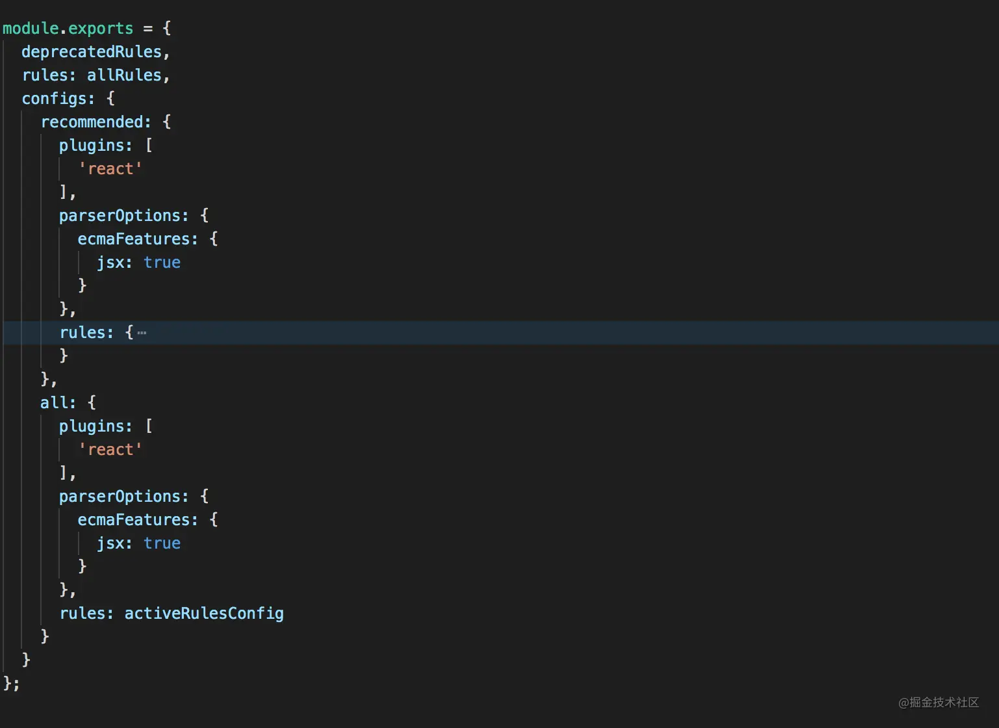

### vscode设置

~~~js
// setting.json
{
  "editor.codeActionsOnSave": {  // 保存时自动修复(不是对所有的eslint都自动修复，自动修改的更多是代码格式问题)
    "source.fixAll.eslint": true
  },
}
~~~

 

### 规则级别

`'off' | 0` : 关闭规则校验

`warn | 1`: 开启规则校验，使用警告级别的错误，只是警告不会报错

`error | 2`: 开启规则校验，使用错误级别的错误，程序启动会报错

 

### 配置方式

1、命令行

2、.eslintrc.js  .eslintrc.json

3、.eslintrc

4、package.json中的 `eslintConfig`字段

 

### eslint默认支持的校验规则列表

http://eslint.cn/docs/rules/

 

### 忽略校验的文件或文件夹

添加`.eslintignore`件来避免检测处理

~~~js
// .eslintignore
node_modules/*
**/vendor/*.js
~~~

 

### 查看插件提供的校验规则和配置方案

比如`eslint-plugin-react` `eslint-plugin-import` `eslint-plugin-xxx`  都可以直接看源码包即可直到提供了那些校验规则

`eslint-config-xxx`：这类规则包一般提供好了校验规则和组件配置，直接`extends`即可，不需要在`rules`中去覆盖。

比如：`eslint-config-react-app`我们一般在`create-react-app`脚手架项目中直接配置

~~~json
{
  "extends": ["react-app"]
}
~~~

比如：`eslint-plugin-vue`插件，本质上是对`rules`的包装，使用方式如下：

~~~json
{
  "extends": [
    "eslint:recommended",
    "plugin:vue/recommended" // 这里是对改插件下的某一类配置对象的引用
  ],
  "plugins": [
    "vue" // 这个是eslint-plugin-vue的缩写，插件声明
  ],
  "rules": {
    "vue/require-v-for-key": "error" // 对具体eslint-plugin-vue插件下的某个规则的使用
  }
}
~~~

 

### create-react-app中 .eslintrc.json

其中`rules`部分可以自定义校验规则，会覆盖`extends`中的校验规则。

~~~json
{
    "env": { // 指定脚本的运行环境。每种环境都有一组特定的预定义全局变量
        "node": true, // 比如global对象
        "mocha": true,
        "jest": true,
        "es6": true, // 对于新的 ES6 全局变量，使用 { "env":{ "es6": true } }自动启用es6语法
        "browser": true // 比如浏览器的window，document对象
    },
    "extends": [ // 规则扩展
        "eslint:recommended",
        "plugin:react/recommended",
        "plugin:react-hooks/recommended"
    ],
    "parser": "babel-eslint", // eslint解析器
    "parserOptions": {  // 解析器配置
        "ecmaFeatures": {
            "jsx": true
        },
        "ecmaVersion": 6, // 支持 ES6 语法并不意味着同时支持新的 ES6 全局变量或类型（比如 Set 等新类型），对于es6语法需要设置
        "sourceType": "module"
    },
    "plugins": [
        "react",  // 集成的插件
        "jsx-a11y",
        "react-hooks"
    ],
    "settings": {
        "react": {
            "version": "detect"
        }
    },
    "globals": { // 脚本在执行期间访问的额外的全局变量。
        "JSX": true,
        "React": true,
        "NodeJS": true,
        "Promise": true
    },
    "rules": { // 启用的规则及其各自的错误级别。
        "react/jsx-uses-vars": 2,
        "react/jsx-wrap-multilines": 2,
        "react-hooks/rules-of-hooks": 2
    }
} 
~~~

 

### extends和plugins的区别

~~~json
{
  "extends": [
    "eslint:recommended",
    "plugin:react/recommended", // 使用eslint-plugin-react提供的recommended配置方案
    "plugin:react-hooks/recommended" // 使用eslint-plugin-react-hooks提供的recommended配置方案
  ],
  "plugins": [ // 给eslint新增校验规则，可以通过rules去自己一个一个开启或者使用上面的extends使用官方配置方案
    "react",
    "jsx-a11y",
    "react-hooks"
  ],
}
~~~

#### plugins

不同的场景和不同规范下有些定制的`eslint`检查需求，`eslint`默认的可选规则中如果没有，就需要做一些扩展。

`plugins`插件主要为`eslint`新增一些校验规则，比如：`eslint-plugin-react`，就会对`react`项目做一些定制的`eslint`规则，`eslint-plugin-react`中`jsx-boolean-value`的一段代码:

~~~js
//	eslint-plugin-react
module.exports = {
  rules: {
    'jsx-boolean-value': { // 为eslint新增一些针对react的校验规则
      meta: {
        docs: {
          description: 'Enforce boolean attributes notation in JSX',
          category: 'Stylistic Issues',
          recommended: false,
          url: docsUrl('jsx-boolean-value')
        },
        fixable: 'code'
      },
      create(context) {}
    }
    // ...
  },
  configs: {
    // ...
    // 后面会说 和extends相关
  }
}
~~~

如何使用：

1、安装插件`yarn add eslint-plugin-react --dev`

2、加载插件，`plugins`只是加载了插件，可以理解赋予了`eslint`解析`jsx-boolean-value`规则的检查能力，真正开启这个规则的检查能力还需要通过配置`rules`（一个插件库里面往往有几十个新规则，并不是每一个规则都需要开启的，这是时候就要根据自己的需求来配置相关检查规则）。

~~~js
// .eslintrc.js
module.export = {
  plugins: ["eslint-plugin-react"],
  rules: {
    'eslint-plugin-react/jsx-boolean-value': 2
  }
}
~~~

这样一个新的`eslint`校验规则就配置好了。

#### extends集成

`plugins和rules结合是eslint基础能力`，`extends可以看做是一个个配置方案的最佳实践`

虽然说需要根据不同需求、风格、规范去配置不同的`eslint`规则，但是往往相似的项目之间需要配置的规则大同小异，如果每个项目都重新一步一步开始配置规则就显得不太人性化，这个时候就是`extends`体现作用的时候。

可以看做是别人配置好的一份`.eslintrc.js`, 通过`extends`把别人的配置好的校验集成进来。

以`eslint-plugin-react`为例，它实现了几十种配置，为了方便别人使用，它默认提供了两种最佳实践`recommended`和`all`(在`configs`中可以看到具体的名称）

原先还需要自己一条一条配置校验规则，现在可以直接把官方配置好的最佳实践拿来用，如果碰到和自己风格或者校验冲突的，可以在`rules`中重新定义校验规则

~~~js
module.export = {
	extends: [
    	'eslint-plugin-react/recommended'
    ]
}
~~~

`extends`除了使用`plugin`中 `config` `name` 的加载方式，往往也会使用`eslint-config-xxxx`这样命名的包。主要是因为有些最佳实践往往不需要自己去重新实现规则检查的方法，只需要去导出一份eslint配置即可。

 

#### 集成

构建工具：

~~~js
Grunt: grunt-eslint
Gulp: gulp-eslint
Browserify: eslintify
Webpack: eslint-loader
Rollup: rollup-plugin-eslint
~~~