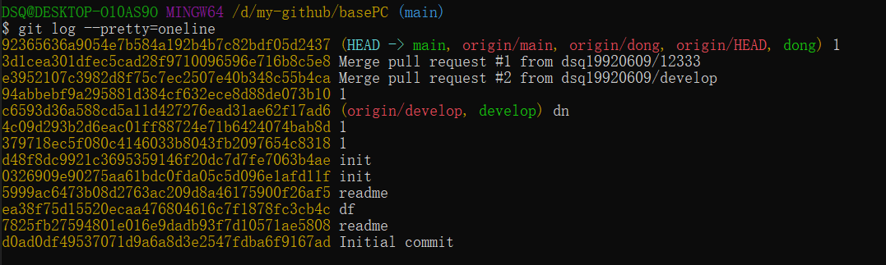

# 日志

#### 查看

~~~
$ git log
~~~

#### 简化版日志
~~~
$ git log --pretty=oneline
~~~

#### 查看前N条日志
~~~
$ git log -N

$ git log --pretty=oneline -N   #组合使用
~~~

#### 查看某一个提交的变更
~~~
$ git show <commit-hash-id>
~~~

#### 退出log状态  
有时日志比较多，可以通过按`q`退出

#### 查看HEAD指向历史和说明  

可以配合`git reset --hard <commit_id>`版本的`向前`恢复和`向后`回退

~~~
$ git reflog -N
~~~
